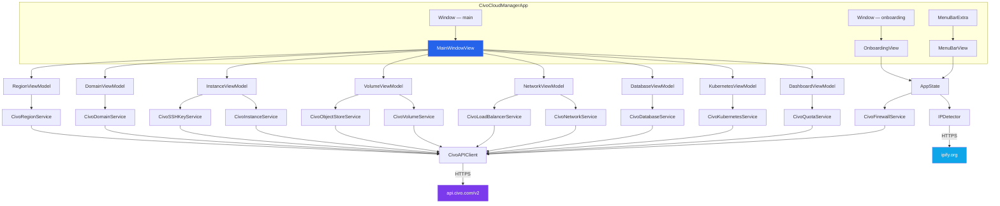
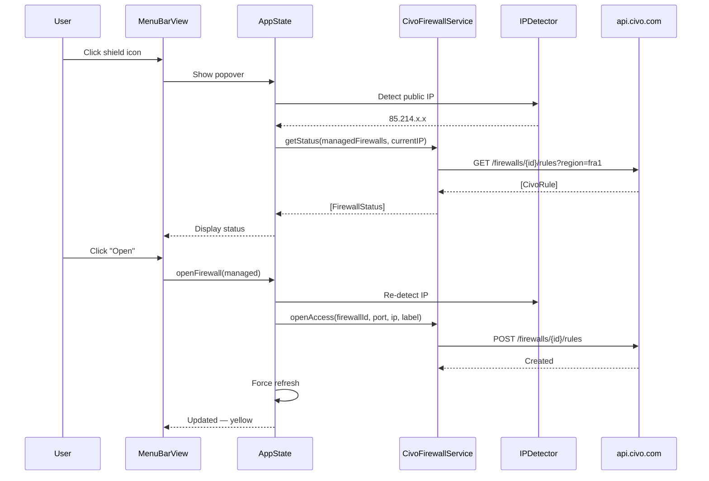
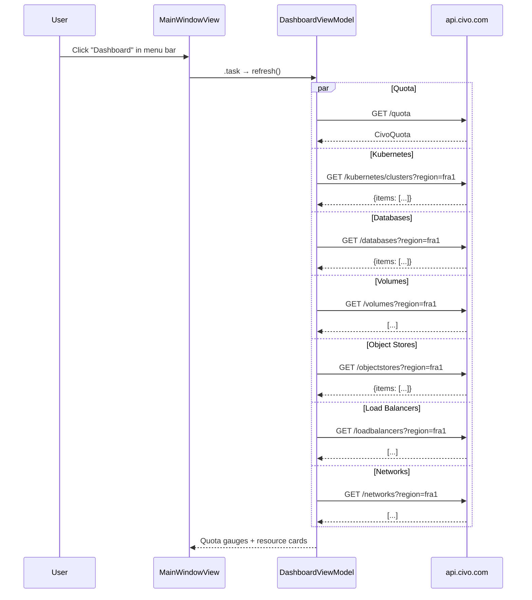
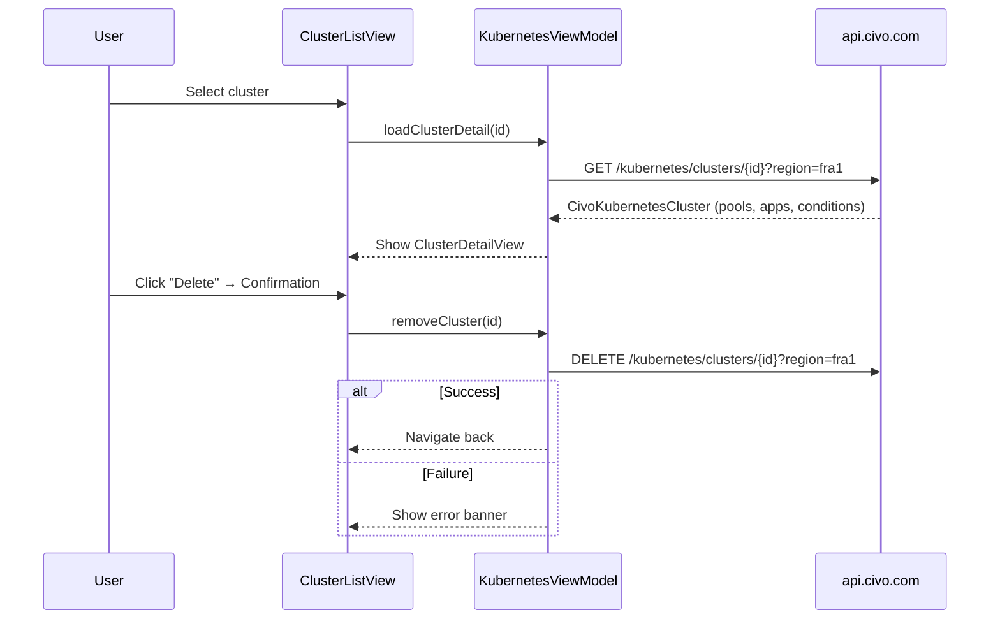
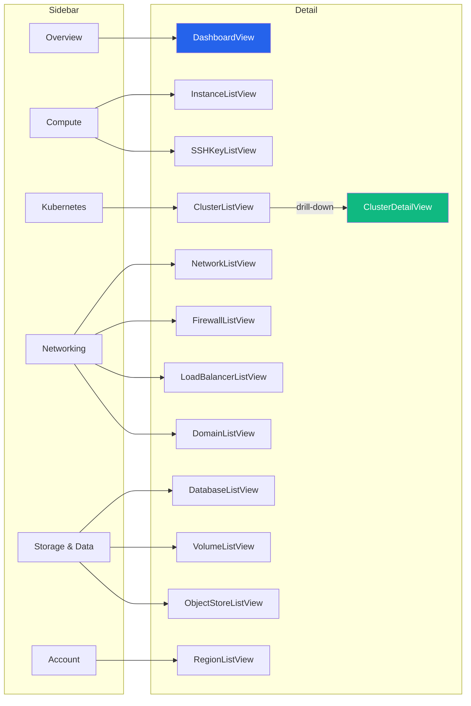

# Civo Cloud Manager

A native macOS application for managing your **Civo Cloud** infrastructure. Menu bar quick-access for firewall rules, full dashboard for all resources. Connects directly to the Civo REST API — no CLI dependency.

## Features

### Menu Bar (Quick Access)
- Open/close firewall rules for your current public IP with one click
- Open All / Close All — bulk manage all configured firewalls
- Per-firewall port configuration
- Auto-detect public IPv4 via ipify.org (3 fallback providers)
- Auto-refresh every 60 seconds
- Launch at Login via SMAppService

### Dashboard (Full Management)
- **Quota overview** — circular gauges for all account limits
- **Kubernetes** — cluster list with drill-down to node pools, conditions, installed apps
- **Databases** — PostgreSQL instances with host, port, size, status
- **Networking** — networks, firewalls, load balancers, domains
- **Storage** — volumes and object stores
- **Compute** — instances and SSH keys
- **Regions** — view available regions, switch active region
- Confirmation dialogs on all destructive operations
- Error banners on every view

### Monetization
- **Free tier** — menu bar firewall management
- **Full Access ($9.99)** — one-time purchase, unlocks dashboard + all resources
- **Apple offer codes** — redeem codes generated in App Store Connect
- **Family Sharing** enabled

### Localization
- 7 languages: English, German, Spanish, French, Italian, Dutch, Polish

### Architecture
- **Native HTTP API** — connects directly to `api.civo.com/v2`, no CLI required
- **App Sandbox** — network client entitlement
- **Keychain** — API key stored securely in macOS Keychain
- **StoreKit 2** — modern in-app purchase with transaction listener
- **Zero dependencies** — only Apple frameworks
- **Swift 6 strict concurrency** — all types Sendable

## Requirements

- **macOS 15+** (Sequoia) / macOS 26 (Tahoe) ready
- **Civo account** with API key (get one at [civo.com](https://www.civo.com))

## Installation

### Build from Source (SPM)

```bash
git clone https://github.com/marcelrgberger/civo-cloud-manager.git
cd civo-cloud-manager
swift build -c release
.build/release/CivoCloudManager
```

### Build from Xcode

```bash
open CivoCloudManager.xcodeproj
# Select scheme "CivoCloudManager" → Cmd+R
```

The Xcode project is generated from `project.yml` via [XcodeGen](https://github.com/yonaskolb/XcodeGen):

```bash
brew install xcodegen
xcodegen generate
open CivoCloudManager.xcodeproj
```

## First Launch

1. The app appears as a **shield icon** in the menu bar
2. The onboarding wizard opens automatically
3. Enter your **Civo API key** (found at civo.com → Account → Security → API Keys)
4. Select your **region** (fra1, lon1, nyc1, etc.)
5. Choose which **firewalls** to manage and set the port for each
6. Optionally enable **Launch at Login**
7. Click **Finish** — the app is ready

## Usage

### Menu Bar

Click the shield icon in the menu bar to open the popover:

| Icon | Meaning |
|------|---------|
| Shield (green) | All firewalls closed |
| Shield (yellow) | Some firewalls open for your IP |
| Shield (red) | Setup not complete |

- **Open** — creates a firewall rule allowing your current IP on the configured port
- **Close** — removes the rule
- **Open All / Close All** — bulk actions for all managed firewalls
- **Dashboard** — opens the full management window
- **Settings** — re-opens the onboarding wizard
- **Refresh** — manually re-checks status

### Dashboard

Click **Dashboard** in the menu bar popover to open the main window.

The sidebar is organized into categories:

| Category | Sections |
|----------|----------|
| **Overview** | Dashboard (quota gauges, resource counts) |
| **Compute** | Instances, SSH Keys |
| **Kubernetes** | Clusters (with detail view for node pools, apps, conditions) |
| **Networking** | Networks, Firewalls, Load Balancers, Domains |
| **Storage & Data** | Databases, Volumes, Object Stores |
| **Account** | Regions |

**Each resource view provides:**
- Live data from the Civo API
- Refresh button in the toolbar
- Error banner if the API call fails
- Context menu with Delete option (where applicable)
- Confirmation dialog before any destructive action

### Kubernetes Detail View

Click a cluster in the list to see:
- Cluster info (version, API endpoint, master IP, DNS, CNI plugin, node size)
- Health conditions (ControlPlaneReady, WorkerNodesReady, ClusterVersionSync)
- Node pools (count, size per pool)
- Installed applications (cert-manager, ingress-nginx, etc.)
- Delete button (with confirmation)

### Firewall Rule Ownership

The app only manages rules it created. Rules are labeled:

```
civo-cloud-<hostname>-<firewall-name>
```

Example: `civo-cloud-Marcels-MacBook-Pro-k8s-cluster-firewall`

This ensures the app never touches rules created by other users or tools.

---

## Architecture

### App Scenes



### Class Diagram — Models

```mermaid
classDiagram
    class CivoFirewall {
        +String id
        +String name
        +String rulesCount
    }

    class CivoRule {
        +String id
        +String? label
        +String? cidr
        +String? ports
    }

    class ManagedFirewall {
        +String id
        +String name
        +Int port
        +Bool enabled
    }

    class FirewallStatus {
        +ManagedFirewall managed
        +Bool isOpen
        +String? ruleId
    }

    class CivoKubernetesCluster {
        +String id
        +String name
        +String status
        +String? kubernetesVersion
        +String? masterIp
        +CivoNodePool[]? pools
        +CivoK8sApp[]? installedApplications
        +CivoK8sCondition[]? conditions
    }

    class CivoNodePool {
        +String id
        +Int? count
        +String? size
    }

    class CivoK8sApp {
        +String? name
        +String? version
    }

    class CivoK8sCondition {
        +String? type
        +String? status
        +Bool isHealthy
    }

    class CivoDatabase {
        +String id
        +String name
        +String status
        +String? software
        +String? host
        +String? port
    }

    class CivoNetwork {
        +String id
        +String? label
        +Bool? isDefault
        +String? status
    }

    class CivoVolume {
        +String id
        +String name
        +Int? sizeGb
        +String? status
    }

    class CivoObjectStore {
        +String id
        +String name
        +Int? maxSize
    }

    class CivoLoadBalancer {
        +String id
        +String name
        +String? publicIp
        +String? state
    }

    class CivoInstance {
        +String id
        +String? hostname
        +String? status
    }

    class CivoRegion {
        +String code
        +String name
        +String? countryName
        +Bool? isDefault
    }

    class CivoQuota {
        +Int instanceCountLimit
        +Int instanceCountUsage
        +QuotaItem[] items
    }

    CivoKubernetesCluster --> CivoNodePool
    CivoKubernetesCluster --> CivoK8sApp
    CivoKubernetesCluster --> CivoK8sCondition
    CivoQuota --> QuotaItem
    FirewallStatus --> ManagedFirewall
```



### Class Diagram — Services

```mermaid
classDiagram
    class CivoAPIClient {
        +get(path) T
        +getPaginatedList(path) T[]
        +getArray(path) T[]
        +post(path, body) T
        +delete(path)
        +validateAPIKey(key) Bool
    }

    class CivoConfig {
        +String apiKey (Keychain)
        +String region (UserDefaults)
    }

    class CivoFirewallService {
        +listFirewalls() CivoFirewall[]
        +getRulesForFirewall(id) CivoRule[]
        +openAccess(firewallId, port, ip, label)
        +closeAccess(firewallId, ruleId)
        +getStatus(managedFirewalls, currentIP) FirewallStatus[]
    }

    class CivoQuotaService { +getQuota() CivoQuota }
    class CivoKubernetesService { +listClusters(); +showCluster(id); +removeCluster(id) }
    class CivoDatabaseService { +listDatabases(); +removeDatabase(id) }
    class CivoNetworkService { +listNetworks() }
    class CivoVolumeService { +listVolumes(); +removeVolume(id) }
    class CivoObjectStoreService { +listObjectStores(); +removeObjectStore(id) }
    class CivoLoadBalancerService { +listLoadBalancers(); +removeLoadBalancer(id) }
    class CivoInstanceService { +listInstances(); +removeInstance(id) }
    class CivoSSHKeyService { +listSSHKeys(); +removeSSHKey(id) }
    class CivoDomainService { +listDomains(); +listRecords(domainId); +removeDomain(id) }
    class CivoRegionService { +listRegions() }
    class IPDetector { +detectIP() String }

    CivoFirewallService --> CivoAPIClient
    CivoQuotaService --> CivoAPIClient
    CivoKubernetesService --> CivoAPIClient
    CivoDatabaseService --> CivoAPIClient
    CivoNetworkService --> CivoAPIClient
    CivoVolumeService --> CivoAPIClient
    CivoObjectStoreService --> CivoAPIClient
    CivoLoadBalancerService --> CivoAPIClient
    CivoInstanceService --> CivoAPIClient
    CivoSSHKeyService --> CivoAPIClient
    CivoDomainService --> CivoAPIClient
    CivoRegionService --> CivoAPIClient
```



### Data Flow — Menu Bar Firewall



### Data Flow — Dashboard



### Data Flow — Kubernetes Detail



### Main Window Navigation



---

## Civo API Reference

The app uses the [Civo REST API v2](https://www.civo.com/api). Authentication is via bearer token.

### Endpoint Response Formats

Some Civo API endpoints return paginated objects, others return plain arrays:

| Endpoint | HTTP | Format | Region |
|----------|------|--------|--------|
| `/quota` | GET | Single `{}` | No |
| `/kubernetes/clusters` | GET | Paginated `{items:[]}` | Yes |
| `/kubernetes/clusters/:id` | GET | Single `{}` | Yes |
| `/databases` | GET | Paginated `{items:[]}` | Yes |
| `/instances` | GET | Paginated `{items:[]}` | Yes |
| `/objectstores` | GET | Paginated `{items:[]}` | Yes |
| `/firewalls` | GET | Array `[]` | Yes |
| `/firewalls/:id/rules` | GET | Array `[]` | Yes |
| `/volumes` | GET | Array `[]` | Yes |
| `/loadbalancers` | GET | Array `[]` | Yes |
| `/networks` | GET | Array `[]` | Yes |
| `/regions` | GET | Array `[]` | No |
| `/sshkeys` | GET | Array `[]` | No |
| `/dns` | GET | Array `[]` | No |

### JSON Quirks

| Field | Expected | Actual | Handled |
|-------|----------|--------|---------|
| `rules_count` | Int | **String or Int** | Custom decoder |
| `cidr` | Array | **String or Array** | Custom decoder |
| `loadbalancer.Backends` | `backends` | **Capital B** (`Backends`) | CodingKey |
| `database.nodes` | Int | **String** (`"1"`) | String model |
| `database.port` | Int | **String** (`"5432"`) | String model |

---

## Configuration

All settings are stored in UserDefaults under the `de.berger-rosenstock.CivoCloudManager` domain:

| Key | Storage | Description |
|-----|---------|-------------|
| API Key | **macOS Keychain** | Civo API key (encrypted) |
| `CivoCloudManager.region` | UserDefaults | Active region code (e.g. `fra1`) |
| `CivoCloudManager.managedFirewalls` | Data (JSON) | Selected firewalls with ports |
| `CivoCloudManager.launchAtLogin` | Bool | Auto-start on login |
| `CivoCloudManager.onboardingComplete` | Bool | Setup wizard completed |

---

## Testing

The project includes 21 decoding tests that verify all model types parse correctly against real Civo API responses.

```bash
swift test
```

```
✔ Test run with 21 tests in 1 suite passed after 0.001 seconds.
```

Tests cover:
- All 14 model types (quota, k8s cluster, database, firewall, rule, network, volume, object store, load balancer, instance, SSH key, domain, region, conditions)
- Both response formats (paginated `{items:[]}` and plain `[]`)
- Edge cases (CIDR as string vs array, Backends capital B, quota percentage calculation)
- CivoAccessLabel generation

---

## Tech Stack

| Component | Technology |
|-----------|-----------|
| Language | Swift 6.0 (strict concurrency) |
| UI | SwiftUI (MenuBarExtra, Window, NavigationSplitView) |
| Platform | macOS 15+ |
| API | Civo REST API v2 via URLSession |
| IP Detection | ipify.org + ifconfig.me + icanhazip.com |
| Secrets | macOS Keychain (API key) |
| Persistence | UserDefaults (settings) |
| Purchases | StoreKit 2 (Non-Consumable) |
| Localization | String Catalog — 7 languages |
| Login | SMAppService |
| Logging | os.Logger (privacy: .private) |
| Dependencies | None (Apple frameworks only) |

---

## Project Structure

```
civo-cloud-manager/
├── project.yml                                # XcodeGen project definition
├── CivoCloudManager.xcodeproj/                # Xcode project (primary build)
├── Package.swift                              # SPM (tests only)
├── CivoCloudManager/
│   ├── Info.plist                              # App metadata + localizations
│   ├── CivoCloudManager.entitlements           # App Sandbox + network
│   ├── CivoCloudManager.storekit              # StoreKit test configuration
│   ├── Localizable.xcstrings                   # String catalog (7 languages)
│   ├── PrivacyInfo.xcprivacy                   # Apple privacy manifest
│   └── Assets.xcassets/                        # App icon + accent color
├── Sources/
│   ├── App/
│   │   └── CivoCloudManagerApp.swift           # @main — 3 scenes
│   ├── Models/
│   │   ├── CivoAccessLabel.swift               # Rule label generation
│   │   ├── FirewallRule.swift                   # CivoFirewall, CivoRule, ManagedFirewall, FirewallStatus
│   │   ├── CivoKubernetes.swift                # Cluster, NodePool, App, Condition
│   │   ├── CivoDatabase.swift
│   │   ├── CivoNetwork.swift
│   │   ├── CivoVolume.swift
│   │   ├── CivoObjectStore.swift
│   │   ├── CivoLoadBalancer.swift
│   │   ├── CivoInstance.swift
│   │   ├── CivoSSHKey.swift
│   │   ├── CivoDomain.swift
│   │   ├── CivoRegion.swift
│   │   └── CivoQuota.swift                     # + QuotaItem
│   ├── Services/
│   │   ├── CivoAPIClient.swift                 # HTTP client for api.civo.com/v2
│   │   ├── CivoConfig.swift                    # API key (Keychain) + region
│   │   ├── CivoFirewallService.swift            # Firewall rules via REST
│   │   ├── CivoQuotaService.swift
│   │   ├── CivoKubernetesService.swift
│   │   ├── CivoDatabaseService.swift
│   │   ├── CivoNetworkService.swift
│   │   ├── CivoVolumeService.swift
│   │   ├── CivoObjectStoreService.swift
│   │   ├── CivoLoadBalancerService.swift
│   │   ├── CivoInstanceService.swift
│   │   ├── CivoSSHKeyService.swift
│   │   ├── CivoDomainService.swift
│   │   ├── CivoRegionService.swift
│   │   ├── IPDetector.swift
│   │   └── StoreManager.swift                 # StoreKit 2 IAP ($9.99 lifetime)
│   ├── ViewModels/
│   │   ├── DashboardViewModel.swift
│   │   ├── KubernetesViewModel.swift
│   │   ├── DatabaseViewModel.swift
│   │   ├── NetworkViewModel.swift
│   │   ├── VolumeViewModel.swift
│   │   ├── InstanceViewModel.swift
│   │   ├── DomainViewModel.swift
│   │   └── RegionViewModel.swift
│   ├── Views/
│   │   ├── MenuBarView.swift
│   │   ├── AppState.swift
│   │   ├── OnboardingView.swift
│   │   ├── MainWindow/
│   │   │   ├── MainWindowView.swift             # NavigationSplitView + sidebar
│   │   │   ├── DashboardView.swift
│   │   │   ├── Compute/
│   │   │   │   ├── InstanceListView.swift
│   │   │   │   └── SSHKeyListView.swift
│   │   │   ├── Kubernetes/
│   │   │   │   ├── ClusterListView.swift
│   │   │   │   └── ClusterDetailView.swift
│   │   │   ├── Networking/
│   │   │   │   ├── NetworkListView.swift
│   │   │   │   ├── FirewallListView.swift
│   │   │   │   ├── LoadBalancerListView.swift
│   │   │   │   └── DomainListView.swift
│   │   │   ├── Storage/
│   │   │   │   ├── DatabaseListView.swift
│   │   │   │   ├── VolumeListView.swift
│   │   │   │   └── ObjectStoreListView.swift
│   │   │   └── Account/
│   │   │       └── RegionListView.swift
│   │   └── Shared/
│   │       ├── StatusBadge.swift
│   │       ├── QuotaGauge.swift
│   │       ├── ResourceListRow.swift
│   │       ├── EmptyStateView.swift
│   │       ├── ErrorBanner.swift
│   │       └── PaywallView.swift              # Buy-once paywall + offer codes
│   └── Utilities/
│       └── Logger.swift
├── Tests/
│   └── APIDecodingTests.swift                  # 21 model decoding tests
├── README.md
├── CLAUDE.md
├── LICENSE
└── .gitignore
```

## License

Proprietary. Copyright (c) 2025-2026 Marcel R. G. Berger / Berger & Rosenstock GbR. All rights reserved. Distributed exclusively via the Apple App Store.
