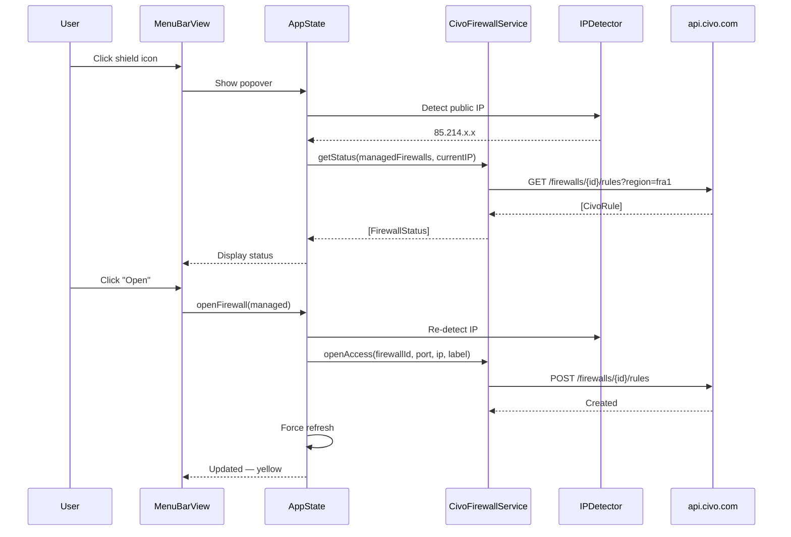
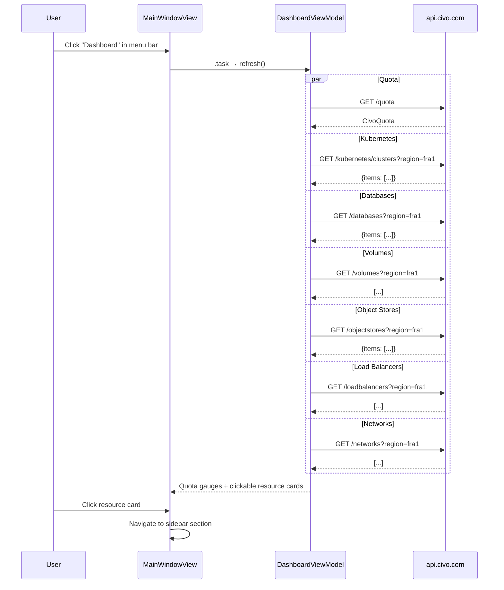
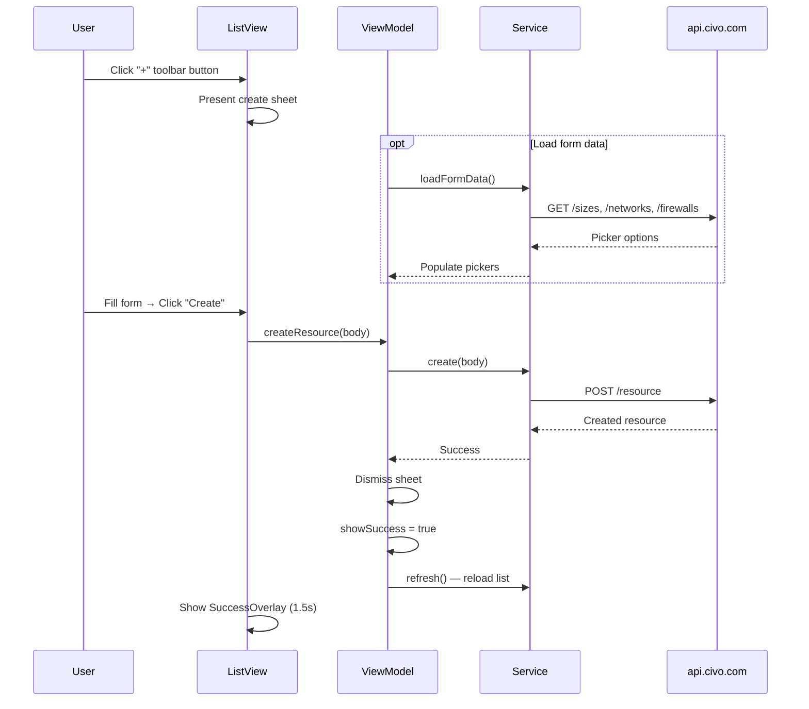
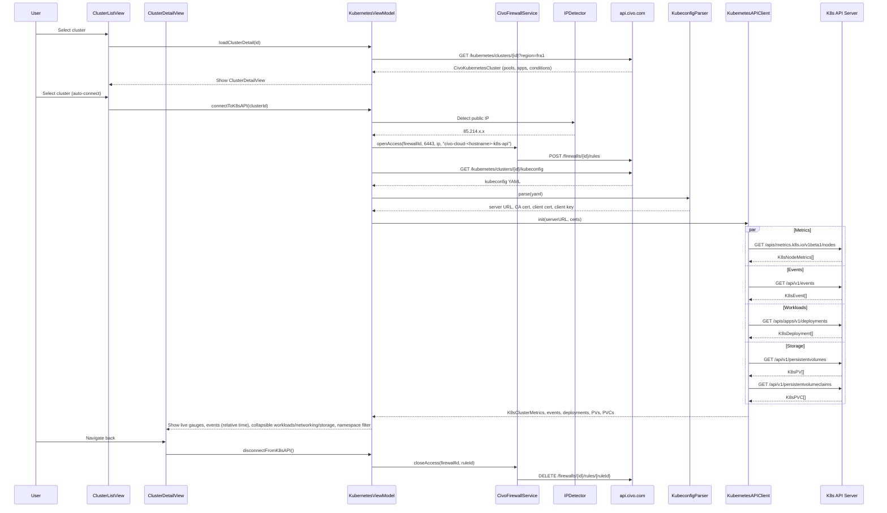
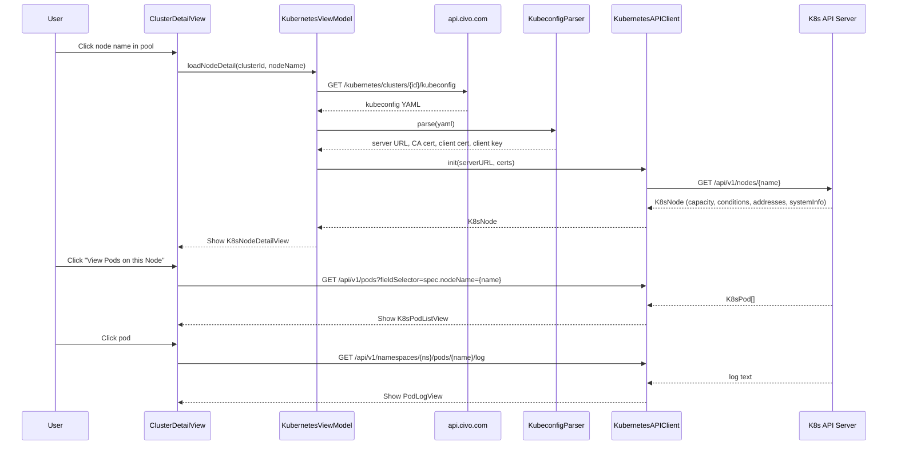
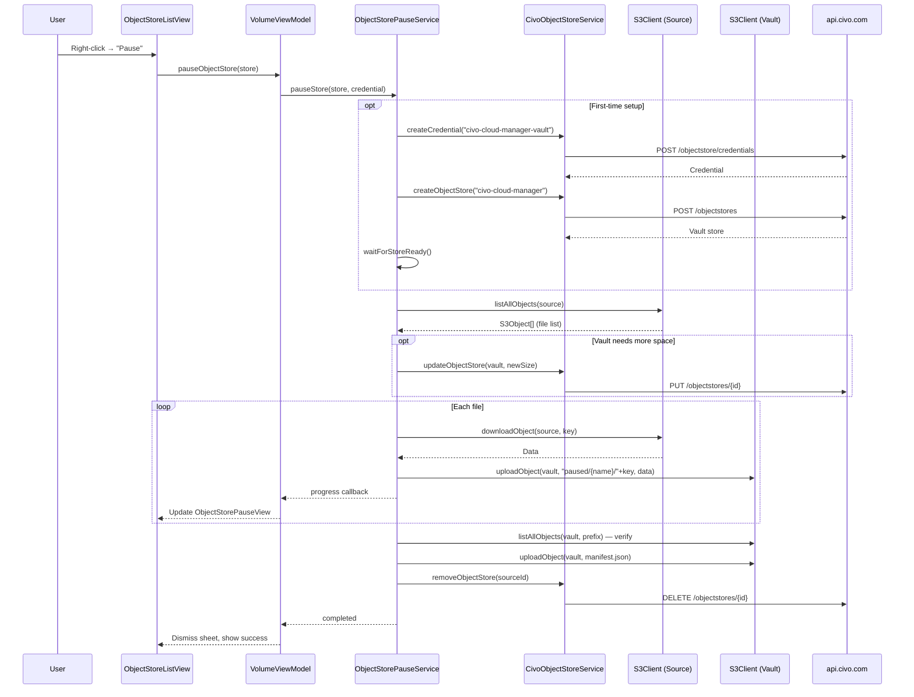
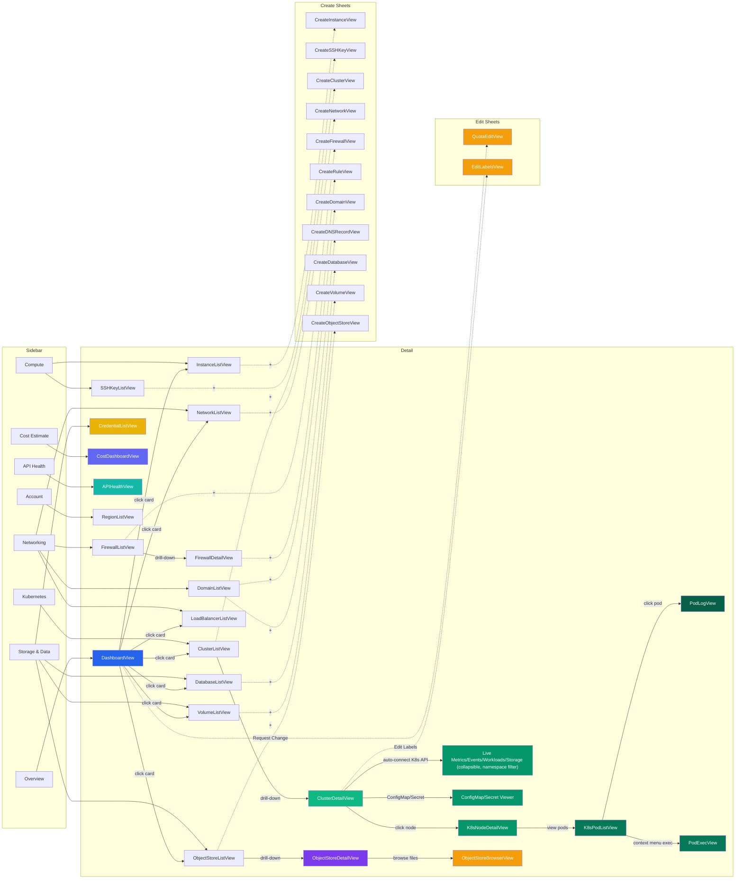

# Civo Cloud Manager

A native macOS application for managing your **Civo Cloud** infrastructure. Menu bar quick-access for firewall rules, full dashboard for all resources. Connects directly to the Civo REST API and Kubernetes API — no CLI dependency.

## Features

### Menu Bar (Quick Access)
- Open/close firewall rules for your current public IP with one click
- Open All / Close All — bulk manage all configured firewalls
- Per-firewall port configuration
- **IP Presets** — save named IPs (Home, Office) for one-click firewall access
- **Auto-close timer** — 15min, 30min, 1h, 2h, or unlimited; auto-closes rules on expiry
- Auto-detect public IPv4 via ipify.org (3 fallback providers)
- Auto-refresh every 60 seconds

### Dashboard (Full Management)
- **Quota overview** — circular gauges with warning badges at 80%/90% threshold
- **Quota increase request** — form with steppers for all quota limits
- **Clickable resource cards** — navigate directly to any resource section
- **Quick Search (⌘K)** — search across all resources by name, keyboard navigation
- **Export (⌘⇧E)** — export resources as JSON with secret redaction
- **Full CRUD** — create, view, and delete resources across all categories

### Compute
- Create instances with **visual size picker grid** (CPU, RAM, NVMe, hourly price per card)
- **Stop, Start, Reboot** from instance detail view
- **Resize** — size picker grid in sheet
- **SSH access** — correct `ssh -i ~/.ssh/key user@ip` command with copy button
- **SSH key generation** — Ed25519 via /usr/bin/ssh-keygen, private key to ~/Downloads, public key uploaded to Civo
- **Reverse DNS** — editable inline
- **Activity log** — local history of all actions with timestamps
- **Auto-refresh** while instance is building (every 5s)
- Tags management

### Kubernetes
- Create clusters with size picker grid (Standard, Performance, CPU/RAM Optimized tabs)
- **Direct K8s API** via PKCS#12 client certificates
- **Auto-connect** on cluster selection, auto-firewall for port 6443
- **Auto-reconnect** when firewall closes
- **Live metrics** — CPU/Memory gauges with **sparkline history charts**
- **ConfigMap/Secret viewer** — list with namespace filter, base64-decoded values
- **Helm releases** — detected from K8s secrets, shows chart version and status
- **Deployment restart** — rollout restart via context menu
- **Pod exec** — run commands in pods via terminal-like UI
- **Pod restart alerts** — macOS notification when pod restarts increase
- **Ingress detail** — TLS status, clickable host URLs, backend info
- Events, workloads, networking, storage sections (collapsible)
- Namespace filter, deployment scaling, PVC-Volume linking
- Node detail, pod list, pod logs with auto-refresh
- Save Kubeconfig, editable node pool labels

### Networking
- Create networks, firewalls, domains
- Add/edit/delete DNS records inline
- Firewall rule drill-down (view, create, delete)
- Delete networks (skips default), firewalls, load balancers

### Storage & Data
- Create databases with size picker grid
- Database credentials (username visible, password via Touch ID)
- Create volumes and object stores
- **S3 file browser** — Table view, multi-select, download to temp + open in Finder
- Object Store credentials management (Touch ID-protected)
- **Object Store Pause/Resume** — archive inactive stores to a central vault to save costs
  - Pause: copies all files to a `civo-cloud-manager` vault store, verifies, then deletes original
  - Resume: recreates store with same name/credentials, restores files, cleans up vault
  - Live progress with file count, byte counters, and current file name
  - Vault auto-resizes (grows before pause, shrinks after resume)
  - Parallel transfers (4 concurrent) for faster copy in both directions
  - Verify-before-delete safety: key + size comparison before removing original
  - Credential assignment dropdown if credential is missing on a recovered store

### Cost Estimate
- **Actual charges** from Civo billing API
- Period: This Month (+ projected), Last Month, Last Quarter, This Year
- Breakdown by resource type and individual resource
- **Editable hourly rates** for custom pricing
- Past months cached locally

### API Health
- Tests all 16 Civo API endpoints with response time
- Color-coded: green <200ms, orange <500ms, red >500ms
- Animated status checks

### Other
- **Regions** — view all regions with resource counts
- **Safe deletion** — type resource name to confirm
- **Smooth animations** — staggered rows, spring transitions, sparklines
- **User-friendly errors** — 500 → "Civo is experiencing issues", cancelled requests suppressed
- **About** — system tools check (/usr/bin/openssl, /usr/bin/ssh-keygen)

### Monetization
- **Free tier** — menu bar firewall management
- **Full Access ($14.99)** — one-time purchase, unlocks dashboard + all resources
- **Family Sharing** enabled, Apple offer codes supported

### Localization
- 8 languages: English, German, Spanish, French, Italian, Dutch, Polish, Portuguese

### Architecture
- **Native HTTP API** — connects directly to `api.civo.com/v2`, no CLI required
- **Direct Kubernetes API** — connects to K8s clusters using PKCS#12 client certificate auth via `/usr/bin/openssl` (pre-installed on macOS) + `SecPKCS12Import`, no kubectl needed
- **S3-compatible file browser** — native S3 client with AWS Signature V4 signing via CryptoKit (HMAC-SHA256), no AWS SDK dependency
- **App Sandbox** — network client entitlement
- **Keychain** — API key stored securely in macOS Keychain
- **StoreKit 2** — modern in-app purchase with transaction listener
- **Zero dependencies** — only Apple frameworks (SwiftUI, CryptoKit, Security, LocalAuthentication, Foundation, os)
- **Swift 6 strict concurrency** — all types Sendable

## Requirements

- **macOS 15+** (Sequoia) / macOS 26 (Tahoe) ready
- **Civo account** with API key (get one at [civo.com](https://www.civo.com))

## Installation

### Build from Source (SPM)

```bash
git clone https://github.com/marcelrgberger/civo-cloud-manager.git
cd civo-cloud-manager
swift build -c release
.build/release/CivoCloudManager
```

### Build from Xcode

```bash
open CivoCloudManager.xcodeproj
# Select scheme "CivoCloudManager" → Cmd+R
```

The Xcode project is generated from `project.yml` via [XcodeGen](https://github.com/yonaskolb/XcodeGen):

```bash
brew install xcodegen
xcodegen generate
open CivoCloudManager.xcodeproj
```

## First Launch

1. The app appears as a **shield icon** in the menu bar
2. The onboarding wizard opens automatically
3. Enter your **Civo API key** (found at civo.com → Account → Security → API Keys)
4. Select your **region** (fra1, lon1, nyc1, etc.)
5. Choose which **firewalls** to manage and set the port for each
6. Optionally enable **Launch at Login**
7. Click **Finish** — the app is ready

## Usage

### Menu Bar

Click the shield icon in the menu bar to open the popover:

| Icon | Meaning |
|------|---------|
| Shield (green) | All firewalls closed |
| Shield (yellow) | Some firewalls open for your IP |
| Shield (red) | Setup not complete |

- **Open** — creates a firewall rule allowing your current IP on the configured port
- **Close** — removes the rule
- **Open All / Close All** — bulk actions for all managed firewalls
- **Dashboard** — opens the full management window
- **Settings** — re-opens the onboarding wizard
- **Refresh** — manually re-checks status

### Dashboard

Click **Dashboard** in the menu bar popover to open the main window.

The sidebar is organized into categories:

| Category | Sections | CRUD |
|----------|----------|------|
| **Overview** | Dashboard (quota gauges, clickable resource cards, quota change request) | Request Change |
| **Compute** | Instances (stop/start/reboot via context menu), SSH Keys | Create, Delete, Stop, Start, Reboot |
| **Kubernetes** | Clusters (detail view for pools, apps, conditions, live metrics, events, workloads with scaling, K8s node details, pod logs with auto-refresh, pod restart, namespace filter, PVC-Volume linking) | Create, Delete, Scale, Restart |
| **Networking** | Networks, Firewalls (with rule drill-down), Load Balancers, Domains | Create, Edit (DNS records, firewall rules), Delete |
| **Storage & Data** | Databases (detail with credentials via Touch ID), Volumes, Object Stores (detail view, credentials, resize, S3 file browser, pause/resume), Credentials (manage Object Store credentials) | Create, Delete, Resize, Browse, Download, Pause, Resume |
| **Account** | Regions | Switch |

**Each resource view provides:**
- Live data from the Civo API
- **"+" button** in the toolbar to create new resources via sheet forms
- Refresh button in the toolbar
- Error banner if the API call fails
- Context menu with Delete option (where applicable)
- **Name-confirmation delete** — typing the exact resource name required before deletion is enabled
- **Success overlay** after successful create/edit

**Network delete** skips the default network — only non-default networks can be deleted.

**Object store detail view** — click an object store to see its detail view with credentials (access key ID, secret access key from linked credential, endpoint as selectable text), configuration (max size, region, status), a resize section with stepper to change max size via PUT /objectstores/:id, and a "Browse Files" button to open the S3 file browser.

**Object store pause/resume** — right-click an object store and select "Pause" to archive it to a central `civo-cloud-manager` vault. All files are copied to the vault, verified, then the original store is deleted to save costs. Paused stores appear in a separate section with an orange pause icon. Click "Resume" to recreate the store and restore all files. A progress sheet shows live file/byte counters during copy. The vault auto-resizes as needed. Enable by clicking the "Enable" banner in the Object Store list.

**Firewall rule drill-down** — click a firewall to see all its rules. Each rule shows protocol, ports, CIDR, direction (ingress/egress), and action (allow/deny) with color-coded badges. Add new rules via "+" toolbar button, delete rules via context menu with name confirmation.

**Quota increase request** — "Request Change" button in the quota section opens a form with steppers for all quota limits, submits via PUT /quota.

**Dashboard cards** are clickable — tap any card to navigate directly to that resource section.

### Create Forms

All create views use grouped SwiftUI forms with Cancel/Create toolbar buttons:

| Resource | Fields |
|----------|--------|
| **Instance** | Hostname, size, disk image, network, firewall, SSH key, tags |
| **SSH Key** | Name, public key (paste) |
| **Kubernetes Cluster** | Name, CNI plugin, node size, node count, network, marketplace apps |
| **Network** | Label, CIDR v4 |
| **Firewall** | Name, network |
| **Domain** | Domain name |
| **DNS Record** | Type (A/AAAA/CNAME/MX/TXT/SRV/NS), name, value, TTL, priority |
| **Database** | Name, software (MySQL/PostgreSQL), version, size, nodes, network, firewall |
| **Volume** | Name, size (GB), network |
| **Object Store** | Name, max size (GB) |

### Kubernetes Detail View

Click a cluster in the list to see:
- Cluster info (version, API endpoint, master IP, DNS, CNI plugin, node size)
- Health conditions (ControlPlaneReady, WorkerNodesReady, ClusterVersionSync)
- Node pools (count, size per pool)
- Installed applications (cert-manager, ingress-nginx, etc.)
- **Auto-connect to K8s API** — the cluster's K8s API is connected lazily when selected, loading live data automatically:
  - **CPU and Memory gauges** — circular percentage gauges (requires metrics-server)
  - **Pod count and Node health** indicators
  - **Namespace filter picker** — filter deployments and services by namespace
  - **Recent cluster events** — relative timestamps ("2m ago", "1h ago"), warnings highlighted in orange
  - **Workloads (collapsible)** — Deployments (with scaling), DaemonSets, StatefulSets, CronJobs in a DisclosureGroup
  - **Networking (collapsible)** — Services, Ingresses in a DisclosureGroup
  - **Storage (collapsible)** — PVCs with linked Civo Volume ID, PVs with capacity in a DisclosureGroup
  - **Graceful fallback** — static cluster stats shown when metrics-server is not installed
- **Save Kubeconfig** toolbar button — exports the kubeconfig as a .yaml file
- Delete button (with confirmation)

### Auto-Firewall for Kubernetes API

When you select a cluster in the list, the app automatically connects to the K8s API (lazy loading, no manual "Connect" button needed) and:
1. Detects your current public IP via IPDetector
2. Opens port 6443 on the cluster's firewall for your IP
3. Labels the rule `civo-cloud-<hostname>-k8s-api`
4. Closes the firewall rule automatically when you navigate back from the cluster

This uses the existing IPDetector and CivoFirewallService infrastructure.

### Kubernetes Node Details

Click a node name in a pool to drill down into K8s node details via direct Kubernetes API access:
- **Resource cards** — CPU, Memory, Pods showing capacity vs allocatable
- **Conditions** — Ready, MemoryPressure, DiskPressure, PIDPressure with health indicators
- **Addresses** — InternalIP, Hostname
- **System Info** — OS, Architecture, Container Runtime, Kubelet Version
- **"View Pods on this Node"** button to see all pods running on that node

### Pod List & Logs

From the node detail view, click "View Pods on this Node" to see:
- All pods on the node with status badge, namespace, ready count, restart count
- Right-click a pod and select "Restart Pod" to delete and restart it
- Click a pod to view its logs in a scrollable monospaced view
- Auto-scroll toggle, refresh button, and auto-refresh toggle (3-second timer) in the log viewer
- Pod header with name, namespace, and status

### Editable Node Pool Labels

In the cluster detail view, click **Edit** on a node pool's labels section to open the label editor:
- Add new key-value labels
- Remove existing labels
- Changes are submitted via PUT to the Civo API

### DNS Record Management

Expand a domain in the domain list to see all records inline:
- **Add Record** button per domain
- **Edit** via context menu — opens pre-filled form
- **Delete** via context menu with confirmation

### Firewall Rule Ownership

The app only manages rules it created. Rules are labeled:

```
civo-cloud-<hostname>-<firewall-name>
```

Example: `civo-cloud-Marcels-MacBook-Pro-k8s-cluster-firewall`

This ensures the app never touches rules created by other users or tools.

---

## Architecture

### App Scenes

```mermaid
graph TB
    subgraph "CivoCloudManagerApp"
        A[MenuBarExtra] --> B[MenuBarView]
        C["Window — onboarding"] --> D[OnboardingView]
        E["Window — main"] --> F[MainWindowView]
    end

    B --> G[AppState]
    D --> G
    F --> H[DashboardViewModel]
    F --> I[KubernetesViewModel]
    F --> J[DatabaseViewModel]
    F --> K[NetworkViewModel]
    F --> L[VolumeViewModel]
    F --> M[InstanceViewModel]
    F --> N[DomainViewModel]
    F --> O[RegionViewModel]

    G --> P[CivoFirewallService]
    G --> Q[IPDetector]
    H --> R[CivoQuotaService]
    H --> S1[CivoKubernetesService]
    H --> S2[CivoDatabaseService]
    H --> S3[CivoVolumeService]
    H --> S4[CivoObjectStoreService]
    H --> S5[CivoLoadBalancerService]
    H --> S6[CivoNetworkService]
    I --> S[CivoKubernetesService]
    I --> S6
    I --> SZ[CivoSizeService]
    I --> KP[KubeconfigParser]
    I --> KA[KubernetesAPIClient]
    I --> P
    I --> Q
    J --> T[CivoDatabaseService]
    J --> S6
    J --> P
    J --> SZ
    K --> U[CivoNetworkService]
    K --> P
    K --> V[CivoLoadBalancerService]
    L --> W[CivoVolumeService]
    L --> X[CivoObjectStoreService]
    L --> S3[S3Client]
    L --> S6
    L --> PS[ObjectStorePauseService]
    PS --> X
    PS --> S3
    M --> Y[CivoInstanceService]
    M --> Z[CivoSSHKeyService]
    M --> S6
    M --> P
    M --> SZ
    N --> AA[CivoDomainService]
    O --> AB[CivoRegionService]

    P --> AC[CivoAPIClient]
    R --> AC
    S --> AC
    T --> AC
    U --> AC
    V --> AC
    W --> AC
    X --> AC
    Y --> AC
    Z --> AC
    AA --> AC
    AB --> AC
    SZ --> AC

    AC -->|HTTPS| AD["api.civo.com/v2"]
    KA -->|HTTPS + mTLS| AK["K8s API Server"]
    S3 -->|HTTPS + SigV4| S3E["Civo Object Store (S3)"]
    Q -->|HTTPS| AE["ipify.org"]

    style AD fill:#7C3AED,color:#fff
    style AE fill:#0EA5E9,color:#fff
    style AK fill:#326CE5,color:#fff
    style S3E fill:#F59E0B,color:#fff
    style F fill:#2563EB,color:#fff
    style KP fill:#10B981,color:#fff
    style KA fill:#10B981,color:#fff
    style S3 fill:#F59E0B,color:#fff
```



### Class Diagram — Models

```mermaid
classDiagram
    class CivoFirewall {
        +String id
        +String name
        +String rulesCount
    }

    class CivoRule {
        +String id
        +String? label
        +String? cidr
        +String? ports
    }

    class ManagedFirewall {
        +String id
        +String name
        +Int port
        +Bool enabled
    }

    class FirewallStatus {
        +ManagedFirewall managed
        +Bool isOpen
        +String? ruleId
    }

    class CivoKubernetesCluster {
        +String id
        +String name
        +String status
        +String? kubernetesVersion
        +String? masterIp
        +CivoNodePool[]? pools
        +CivoK8sApp[]? installedApplications
        +CivoK8sCondition[]? conditions
    }

    class CivoNodePool {
        +String id
        +Int? count
        +String? size
    }

    class CivoK8sApp {
        +String? name
        +String? version
    }

    class CivoK8sCondition {
        +String? type
        +String? status
        +Bool isHealthy
    }

    class K8sNode {
        +String name
        +K8sNodeSpec spec
        +K8sNodeCondition[] conditions
        +K8sNodeAddress[] addresses
        +K8sNodeSystemInfo nodeInfo
        +K8sResourceList capacity
        +K8sResourceList allocatable
    }

    class K8sNodeCondition {
        +String type
        +String status
    }

    class K8sNodeAddress {
        +String type
        +String address
    }

    class K8sNodeSystemInfo {
        +String operatingSystem
        +String architecture
        +String containerRuntimeVersion
        +String kubeletVersion
    }

    class K8sPod {
        +String name
        +String namespace
        +K8sPodStatus status
        +K8sPodSpec spec
    }

    class K8sPodStatus {
        +String phase
        +K8sContainerStatus[] containerStatuses
    }

    class K8sClusterMetrics {
        +Double cpuUsagePercent
        +Double memoryUsagePercent
        +Int podCount
        +Int nodeCount
    }

    class K8sNodeMetrics {
        +String name
        +String cpuUsage
        +String memoryUsage
    }

    class K8sEvent {
        +String type
        +String reason
        +String message
        +K8sObjectReference involvedObject
        +String? lastTimestamp
    }

    class K8sDeployment {
        +String name
        +String namespace
        +K8sDeploymentStatus status
    }

    class K8sDeploymentStatus {
        +Int replicas
        +Int readyReplicas
        +Int availableReplicas
    }

    class K8sPV {
        +String name
        +K8sPVSpec spec
    }

    class K8sPVSpec {
        +String capacity
        +K8sCSISource? csi
    }

    class K8sCSISource {
        +String volumeHandle
    }

    class CivoDatabase {
        +String id
        +String name
        +String status
        +String? software
        +String? publicIpv4
        +Int? port
        +String? username
        +String? password
    }

    class CivoNetwork {
        +String id
        +String? label
        +Bool? isDefault
        +String? status
    }

    class CivoVolume {
        +String id
        +String name
        +Int? sizeGb
        +String? status
    }

    class CivoObjectStore {
        +String id
        +String name
        +Int? maxSize
        +CivoOwnerInfo? ownerInfo
        +String? bucketURL
        +String? region
        +String? createdAt
    }

    class CivoObjectStoreOwner {
        +String? accessKeyId
        +String? credentialId
        +String? name
    }

    class CivoObjectStoreCredential {
        +String id
        +String? name
        +String? accessKeyId
        +String? secretAccessKeyId
        +String? status
        +Bool? suspended
    }

    class S3ListResult {
        +S3Object[] objects
        +String[] commonPrefixes
    }

    class S3Object {
        +String key
        +Int size
        +String lastModified
    }

    class CivoLoadBalancer {
        +String id
        +String name
        +String? publicIp
        +String? state
    }

    class CivoInstance {
        +String id
        +String? hostname
        +String? status
    }

    class CivoRegion {
        +String code
        +String name
        +String? countryName
        +Bool? isDefault
    }

    class CivoQuota {
        +Int instanceCountLimit
        +Int instanceCountUsage
        +QuotaItem[] items
    }

    class CivoSize {
        +String name
        +String? description
        +Int? cpu
        +Int? ram
        +Int? disk
        +String? type
    }

    class CivoDiskImage {
        +String id
        +String? name
        +String? version
        +String? label
    }

    class CivoDomainRecord {
        +String id
        +String? name
        +String? type
        +String? value
        +Int? ttl
        +Int? priority
    }

    class K8sConfigMap {
        +String name
        +String namespace
        +Map~String,String~ data
    }

    class K8sSecret {
        +String name
        +String namespace
        +String type
        +String[] dataKeys
    }

    class HelmRelease {
        +String name
        +String namespace
        +String chart
        +String version
        +String status
        +Int revision
    }

    class CivoCharge {
        +String id
        +String code
        +String label
        +Double numHours
        +Double totalCost
        +String resourceType
    }

    class IPPreset {
        +String id
        +String name
        +String ip
    }

    class BrowserItem {
        +String id
        +String name
        +Bool isFolder
        +Int size
        +String key
    }

    class ActivityEntry {
        +String id
        +Date timestamp
        +String resourceType
        +String action
        +String timeAgo
    }

    CivoKubernetesCluster --> CivoNodePool
    CivoKubernetesCluster --> CivoK8sApp
    CivoKubernetesCluster --> CivoK8sCondition
    K8sNode --> K8sNodeCondition
    K8sNode --> K8sNodeAddress
    K8sNode --> K8sNodeSystemInfo
    K8sPod --> K8sPodStatus
    K8sPodStatus --> K8sContainerStatus
    K8sClusterMetrics --> K8sNodeMetrics
    K8sDeployment --> K8sDeploymentStatus
    K8sEvent --> K8sObjectReference
    K8sPV --> K8sPVSpec
    K8sPVSpec --> K8sCSISource
    CivoObjectStore --> CivoObjectStoreOwner
    CivoObjectStore ..> CivoObjectStoreCredential : credential_id
    S3ListResult --> S3Object
    CivoQuota --> QuotaItem
    FirewallStatus --> ManagedFirewall
    CivoDomain --> CivoDomainRecord
```



### Class Diagram — Services

```mermaid
classDiagram
    class CivoAPIClient {
        +get(path) T
        +getPaginatedList(path) T[]
        +getArray(path) T[]
        +post(path, body) T
        +put(path, body) T
        +delete(path)
        +validateAPIKey(key) Bool
    }

    class KubeconfigParser {
        +parse(yaml) KubeconfigData
        +extractServerURL() String
        +extractCACert() Data
        +extractClientCert() Data
        +extractClientKey() Data
    }

    class KubernetesAPIClient {
        +getNodes() K8sNode[]
        +getNode(name) K8sNode
        +getPods(nodeName) K8sPod[]
        +getPodLogs(namespace, name) String
        +deletePod(namespace, name)
        +scaleDeployment(namespace, name, replicas)
        +listPVs() K8sPV[]
        +execute(path, method, body) Data
        +getMetrics() K8sClusterMetrics
        +getEvents() K8sEvent[]
        +getDeployments() K8sDeployment[]
    }

    class K8sMetricsParser {
        +parseNodeMetrics(data) K8sNodeMetrics[]
        +parsePodMetrics(data) K8sPodMetrics[]
        +computeClusterMetrics() K8sClusterMetrics
    }

    class CivoConfig {
        +String apiKey (Keychain)
        +String region (UserDefaults)
    }

    class CivoFirewallService {
        +listFirewalls() CivoFirewall[]
        +createFirewall(body) CivoFirewall
        +removeFirewall(id)
        +getRulesForFirewall(id) CivoRule[]
        +openAccess(firewallId, port, ip, label)
        +closeAccess(firewallId, ruleId)
        +getStatus(managedFirewalls, currentIP) FirewallStatus[]
    }

    class CivoQuotaService { +getQuota() CivoQuota; +updateQuota(body) }
    class CivoKubernetesService { +listClusters(); +showCluster(id); +createCluster(body); +updateCluster(id, body); +removeCluster(id); +getKubeconfig(id) String }
    class CivoDatabaseService { +listDatabases(); +createDatabase(body); +removeDatabase(id) }
    class CivoNetworkService { +listNetworks(); +createNetwork(body); +updateNetwork(id, body); +removeNetwork(id) }
    class CivoVolumeService { +listVolumes(); +createVolume(body); +removeVolume(id) }
    class CivoObjectStoreService { +listObjectStores(); +showObjectStore(id); +createObjectStore(body); +updateObjectStore(id, body); +removeObjectStore(id); +listCredentials(); +showCredential(id); +createCredential(body); +removeCredential(id) }

    class S3Client {
        +String endpoint
        +String accessKey
        +String secretKey
        +String region
        +listObjects(bucket, prefix, delimiter) S3ListResult
        +listAllObjects(bucket, prefix) S3Object[]
        +downloadObject(bucket, key) Data
        +uploadObject(bucket, key, data)
        +deleteObject(bucket, key)
        +deleteObjects(bucket, keys)
        +headObject(bucket, key) (size, contentType)
    }

    class ObjectStorePauseService {
        +setupVault() (CivoObjectStore, CivoObjectStoreCredential)
        +pauseStore(store, credential, progress)
        +resumeStore(paused, progress)
        +loadPausedStores() PausedObjectStore[]
        +findVault() CivoObjectStore?
    }

    class CivoLoadBalancerService { +listLoadBalancers(); +removeLoadBalancer(id) }
    class CivoInstanceService { +listInstances(); +createInstance(body); +updateInstance(id, body); +removeInstance(id); +stopInstance(id); +startInstance(id); +rebootInstance(id) }
    class CivoSSHKeyService { +listSSHKeys(); +createSSHKey(body); +removeSSHKey(id) }
    class CivoDomainService { +listDomains(); +createDomain(body); +updateDomain(id, body); +listRecords(id); +createRecord(id, body); +updateRecord(id, rid, body); +removeRecord(id, rid); +removeDomain(id) }
    class CivoRegionService { +listRegions() }
    class CivoSizeService { +listSizes(); +listDiskImages() }
    class IPDetector { +detectIP() String }
    class CivoChargesService { +getCharges() CivoCharge[]; +getChargesForRange(from, to) CivoCharge[] }
    class NotificationService { +requestPermission(); +sendAlert(title, body) }
    class ActivityLog { +log(entry); +clear(); +entries() ActivityEntry[] }

    CivoFirewallService --> CivoAPIClient
    CivoQuotaService --> CivoAPIClient
    CivoKubernetesService --> CivoAPIClient
    CivoDatabaseService --> CivoAPIClient
    CivoNetworkService --> CivoAPIClient
    CivoVolumeService --> CivoAPIClient
    CivoObjectStoreService --> CivoAPIClient
    CivoLoadBalancerService --> CivoAPIClient
    CivoInstanceService --> CivoAPIClient
    CivoSSHKeyService --> CivoAPIClient
    CivoDomainService --> CivoAPIClient
    CivoRegionService --> CivoAPIClient
    CivoSizeService --> CivoAPIClient
    KubeconfigParser ..> CivoKubernetesService : parses kubeconfig from
    KubernetesAPIClient ..> KubeconfigParser : uses parsed certs
    K8sMetricsParser ..> KubernetesAPIClient : parses metrics from
    S3Client ..> CivoObjectStoreService : uses credentials from
    ObjectStorePauseService --> CivoObjectStoreService
    ObjectStorePauseService --> S3Client
    CivoChargesService --> CivoAPIClient
```



### Data Flow — Menu Bar Firewall



### Data Flow — Dashboard



### Data Flow — Create Resource



### Data Flow — Kubernetes Detail with Live Metrics



### Data Flow — Kubernetes API Access (Node Details & Pod Logs)



### Data Flow — Object Store Pause/Resume



### Main Window Navigation



---

## Civo API Reference

The app uses the [Civo REST API v2](https://www.civo.com/api). Authentication is via bearer token.

### Endpoint Response Formats

Some Civo API endpoints return paginated objects, others return plain arrays:

| Endpoint | HTTP Methods | Format | Region |
|----------|-------------|--------|--------|
| `/quota` | GET, PUT | Single `{}` | No |
| `/kubernetes/clusters` | GET, POST | Paginated `{items:[]}` | Yes |
| `/kubernetes/clusters/:id` | GET, PUT, DELETE | Single `{}` | Yes |
| `/kubernetes/clusters/:id/kubeconfig` | GET | Plain text (YAML) | Yes |
| `/databases` | GET, POST | Paginated `{items:[]}` | Yes |
| `/databases/:id` | DELETE | Single `{}` | Yes |
| `/instances` | GET, POST | Paginated `{items:[]}` | Yes |
| `/instances/:id` | PUT, DELETE | Single `{}` | Yes |
| `/instances/:id/stop` | PUT | Single `{}` | Yes |
| `/instances/:id/start` | PUT | Single `{}` | Yes |
| `/instances/:id/reboot` | PUT | Single `{}` | Yes |
| `/objectstores` | GET, POST | Paginated `{items:[]}` | Yes |
| `/objectstores/:id` | PUT, DELETE | Single `{}` | Yes |
| `/objectstore/credentials` | GET, POST | Paginated `{items:[]}` | Yes |
| `/objectstore/credentials/:id` | DELETE | — | Yes |
| `/objectstores/credentials/:id` | GET | Single `{}` | Yes |
| `/firewalls` | GET, POST | Array `[]` | Yes |
| `/firewalls/:id` | DELETE | — | Yes |
| `/firewalls/:id/rules` | GET, POST | Array `[]` | Yes |
| `/firewalls/:id/rules/:rid` | DELETE | — | Yes |
| `/volumes` | GET, POST | Array `[]` | Yes |
| `/volumes/:id` | DELETE | — | Yes |
| `/loadbalancers` | GET | Array `[]` | Yes |
| `/loadbalancers/:id` | DELETE | — | Yes |
| `/networks` | GET, POST | Array `[]` | Yes |
| `/networks/:id` | PUT, DELETE | Single `{}` | Yes |
| `/regions` | GET | Array `[]` | No |
| `/sshkeys` | GET, POST | Array `[]` | No |
| `/sshkeys/:id` | DELETE | — | No |
| `/dns` | GET, POST | Array `[]` | No |
| `/dns/:id` | PUT, DELETE | — | No |
| `/dns/:id/records` | GET, POST | Array `[]` | No |
| `/dns/:id/records/:rid` | PUT, DELETE | — | No |
| `/sizes` | GET | Array `[]` | Yes |
| `/disk_images` | GET | Array `[]` | Yes |

### JSON Quirks

| Field | Expected | Actual | Handled |
|-------|----------|--------|---------|
| `rules_count` | Int | **String or Int** | Custom decoder |
| `cidr` | Array | **String or Array** | Custom decoder |
| `loadbalancer.Backends` | `backends` | **Capital B** (`Backends`) | CodingKey |
| `database.nodes` | Int | **Int** | Direct |
| `database.port` | Int | **Int** | Direct |

---

## Configuration

All settings are stored in UserDefaults under the `de.berger-rosenstock.CivoCloudManager` domain:

| Key | Storage | Description |
|-----|---------|-------------|
| API Key | **macOS Keychain** | Civo API key (encrypted) |
| `CivoCloudManager.region` | UserDefaults | Active region code (e.g. `fra1`) |
| `CivoCloudManager.managedFirewalls` | Data (JSON) | Selected firewalls with ports |
| `CivoCloudManager.launchAtLogin` | Bool | Auto-start on login |
| `CivoCloudManager.onboardingComplete` | Bool | Setup wizard completed |

---

## Testing

The project includes 21 decoding tests that verify all model types parse correctly against real Civo API responses.

```bash
swift test
```

```
✔ Test run with 21 tests in 1 suite passed after 0.001 seconds.
```

Tests cover:
- All 14 model types (quota, k8s cluster, database, firewall, rule, network, volume, object store, load balancer, instance, SSH key, domain, region, conditions)
- Both response formats (paginated `{items:[]}` and plain `[]`)
- Edge cases (CIDR as string vs array, Backends capital B, quota percentage calculation)
- CivoAccessLabel generation

---

## Tech Stack

| Component | Technology |
|-----------|-----------|
| Language | Swift 6.0 (strict concurrency) |
| UI | SwiftUI (MenuBarExtra, Window, NavigationSplitView) |
| Platform | macOS 15+ |
| API | Civo REST API v2 via URLSession |
| Kubernetes API | Direct K8s API via client certificate auth (openssl PKCS#12 + Security.framework) |
| S3 API | S3-compatible object store access via AWS Signature V4 (CryptoKit) |
| IP Detection | ipify.org + ifconfig.me + icanhazip.com |
| Secrets | macOS Keychain (API key) |
| Persistence | UserDefaults (settings) |
| Purchases | StoreKit 2 (Non-Consumable) |
| Localization | String Catalog — 8 languages |
| Login | SMAppService |
| Logging | os.Logger (privacy: .private) |
| Biometrics | LocalAuthentication (Touch ID / password for secrets) |
| Dependencies | None (Apple frameworks only) |

---

## Project Structure

```
civo-cloud-manager/
├── project.yml                                # XcodeGen project definition
├── CivoCloudManager.xcodeproj/                # Xcode project (primary build)
├── Package.swift                              # SPM (tests only)
├── CivoCloudManager/
│   ├── Info.plist                              # App metadata + localizations
│   ├── CivoCloudManager.entitlements           # App Sandbox + network
│   ├── CivoCloudManager.storekit              # StoreKit test configuration
│   ├── Localizable.xcstrings                   # String catalog (8 languages)
│   ├── PrivacyInfo.xcprivacy                   # Apple privacy manifest
│   └── Assets.xcassets/                        # App icon + accent color
├── Sources/
│   ├── App/
│   │   └── CivoCloudManagerApp.swift           # @main — 3 scenes
│   ├── Models/
│   │   ├── CivoAccessLabel.swift               # Rule label generation
│   │   ├── FirewallRule.swift                   # CivoFirewall, CivoRule, ManagedFirewall, FirewallStatus
│   │   ├── CivoKubernetes.swift                # Cluster, NodePool, App, Condition
│   │   ├── K8sNode.swift                       # K8sNode, K8sNodeCondition, K8sNodeAddress, K8sResourceList, K8sNodeSystemInfo, K8sNodeSpec, K8sNodeTaint
│   │   ├── K8sPod.swift                        # K8sPod, K8sPodStatus, K8sContainerStatus, K8sPodSpec, K8sContainer
│   │   ├── K8sMetrics.swift                    # K8sNodeMetrics, K8sPodMetrics, K8sClusterMetrics, K8sMetricsParser
│   │   ├── K8sEvent.swift                      # K8sEvent, K8sObjectReference
│   │   ├── K8sWorkload.swift                   # K8sDeployment, K8sDeploymentStatus
│   │   ├── K8sStorage.swift                    # K8sPV, K8sPVSpec, K8sCSISource
│   │   ├── CivoDatabase.swift
│   │   ├── CivoNetwork.swift
│   │   ├── CivoVolume.swift
│   │   ├── CivoObjectStore.swift               # + ownerInfo (accessKeyId, credentialId), objectstoreEndpoint
│   │   ├── CivoObjectStoreCredential.swift    # Credential model (accessKeyId, secretAccessKeyId, status, suspended)
│   │   ├── CivoLoadBalancer.swift
│   │   ├── CivoInstance.swift
│   │   ├── CivoSSHKey.swift
│   │   ├── CivoDomain.swift                    # + CivoDomainRecord
│   │   ├── CivoRegion.swift
│   │   ├── CivoQuota.swift                     # + QuotaItem (RAM/DB RAM in GB)
│   │   ├── CivoSize.swift                      # Instance/K8s/DB sizes
│   │   └── CivoDiskImage.swift                 # OS disk images for instances
│   ├── Services/
│   │   ├── CivoAPIClient.swift                 # HTTP client — GET, POST, PUT, DELETE
│   │   ├── CivoConfig.swift                    # API key (Keychain) + region
│   │   ├── CivoFirewallService.swift           # Firewall CRUD + rule management + removeFirewall
│   │   ├── CivoQuotaService.swift              # GET /quota + PUT /quota (change request)
│   │   ├── CivoKubernetesService.swift         # List, show, create, update, delete + kubeconfig
│   │   ├── KubeconfigParser.swift              # Parse kubeconfig YAML → server URL, CA cert, client cert, client key
│   │   ├── KubernetesAPIClient.swift           # Direct K8s API — nodes, pods, logs, metrics, events, deployments, PVs, deletePod, scaleDeployment via PKCS#12 client cert auth
│   │   ├── CivoDatabaseService.swift           # List, create, delete
│   │   ├── CivoNetworkService.swift            # List, create, update, delete (removeNetwork)
│   │   ├── CivoVolumeService.swift             # List, create, delete
│   │   ├── CivoObjectStoreService.swift        # List, show, create, update (resize), delete + credential CRUD
│   │   ├── S3Client.swift                     # S3-compatible client — AWS Signature V4 via CryptoKit, ListObjects v2, GetObject, PutObject, DeleteObject, HeadObject, XML parsing
│   │   ├── ObjectStorePauseService.swift      # Pause/resume Object Stores — vault management, copy, verify, manifest
│   │   ├── CivoLoadBalancerService.swift       # List, delete
│   │   ├── CivoInstanceService.swift           # List, create, update, delete, stop, start, reboot
│   │   ├── CivoSSHKeyService.swift             # List, create, delete
│   │   ├── CivoDomainService.swift             # Domains + records CRUD
│   │   ├── CivoRegionService.swift
│   │   ├── CivoSizeService.swift               # GET /sizes, GET /disk_images
│   │   ├── IPDetector.swift
│   │   └── StoreManager.swift                 # StoreKit 2 IAP ($14.99 lifetime)
│   ├── ViewModels/
│   │   ├── DashboardViewModel.swift
│   │   ├── KubernetesViewModel.swift           # + create/update, form data, K8s API (nodes, pods, logs, metrics, events, workloads, PVs), auto-firewall, restartPod, scaleDeployment, selectedNamespace, filteredDeployments/filteredServices
│   │   ├── DatabaseViewModel.swift             # + create, form data
│   │   ├── NetworkViewModel.swift              # + create network/firewall, update, delete network/firewall/LB
│   │   ├── VolumeViewModel.swift               # + create volume/object store, cleanup unused, resize, pause/resume object store
│   │   ├── InstanceViewModel.swift             # + create instance/SSH key, form data
│   │   ├── DomainViewModel.swift               # + create/update domain/record
│   │   └── RegionViewModel.swift
│   ├── Views/
│   │   ├── MenuBarView.swift
│   │   ├── AppState.swift
│   │   ├── OnboardingView.swift
│   │   ├── MainWindow/
│   │   │   ├── MainWindowView.swift             # NavigationSplitView + sidebar
│   │   │   ├── DashboardView.swift              # Clickable cards → sidebar nav
│   │   │   ├── QuotaEditView.swift              # Quota increase request form (steppers + PUT /quota)
│   │   │   ├── Compute/
│   │   │   │   ├── InstanceListView.swift       # + toolbar, sheet, overlay
│   │   │   │   ├── SSHKeyListView.swift         # + toolbar, sheet, overlay
│   │   │   │   ├── CreateInstanceView.swift     # Form: hostname, size, image, ...
│   │   │   │   └── CreateSSHKeyView.swift       # Form: name, public key
│   │   │   ├── Kubernetes/
│   │   │   │   ├── ClusterListView.swift        # + toolbar, sheet, overlay
│   │   │   │   ├── ClusterDetailView.swift      # Pools, apps, conditions, save kubeconfig, Connect to K8s API, live metrics/events/workloads
│   │   │   │   ├── CreateClusterView.swift      # Form: name, CNI, nodes, apps
│   │   │   │   ├── K8sNodeDetailView.swift      # Node resources, conditions, addresses, system info
│   │   │   │   ├── K8sPodListView.swift         # Pods on a node with status, namespace, restarts
│   │   │   │   ├── PodLogView.swift             # Scrollable monospaced logs, auto-scroll, refresh
│   │   │   │   └── EditLabelsView.swift         # Add/remove labels on node pools
│   │   │   ├── Networking/
│   │   │   │   ├── NetworkListView.swift        # + toolbar, sheet, overlay, context delete
│   │   │   │   ├── FirewallListView.swift       # + drill-down to FirewallDetailView
│   │   │   │   ├── FirewallDetailView.swift     # Rule list with add/delete
│   │   │   │   ├── CreateRuleView.swift         # Form: protocol, ports, CIDR, direction, action
│   │   │   │   ├── LoadBalancerListView.swift   # + context delete
│   │   │   │   ├── DomainListView.swift         # + inline records, edit, delete
│   │   │   │   ├── CreateNetworkView.swift      # Form: label, CIDR
│   │   │   │   ├── CreateFirewallView.swift     # Form: name, network
│   │   │   │   ├── CreateDomainView.swift       # Form: domain name
│   │   │   │   └── CreateDNSRecordView.swift    # Form: type, name, value, TTL
│   │   │   ├── Storage/
│   │   │   │   ├── DatabaseListView.swift       # + toolbar, sheet, overlay
│   │   │   │   ├── DatabaseDetailView.swift     # Connection details, credentials (Touch ID), config, network/firewall
│   │   │   │   ├── VolumeListView.swift         # + toolbar, sheet, overlay
│   │   │   │   ├── VolumeDetailView.swift       # Attachment status, mountpoint, size
│   │   │   │   ├── ObjectStoreListView.swift    # + toolbar, sheet, overlay, pause/resume, vault status
│   │   │   │   ├── ObjectStoreDetailView.swift  # Credentials, config, resize, browse files button
│   │   │   │   ├── ObjectStoreBrowserView.swift # S3 file browser — breadcrumbs, folders, files, download
│   │   │   │   ├── ObjectStorePauseView.swift   # Pause/resume progress sheet — animated, file/byte counters
│   │   │   │   ├── CredentialListView.swift     # Object Store credentials — list, create, delete, Touch ID secrets
│   │   │   │   ├── CreateDatabaseView.swift     # Form: name, software, size, ...
│   │   │   │   ├── CreateVolumeView.swift       # Form: name, size, network
│   │   │   │   └── CreateObjectStoreView.swift  # Form: name, max size
│   │   │   └── Account/
│   │   │       └── RegionListView.swift
│   │   └── Shared/
│   │       ├── StatusBadge.swift
│   │       ├── QuotaGauge.swift
│   │       ├── ResourceListRow.swift
│   │       ├── EmptyStateView.swift
│   │       ├── ErrorBanner.swift
│   │       ├── SuccessOverlay.swift             # Green checkmark, spring auto-dismiss
│   │       ├── DeleteConfirmationSheet.swift   # Name-match confirmation for deletes
│   │       ├── StaggeredAppear.swift           # ViewModifier for staggered row animations
│   │       ├── K8sConnectingView.swift        # Animated K8s connection progress (5 steps, rotating helm, pulsing circle)
│   │       └── PaywallView.swift              # Buy-once paywall + ToS/Privacy links
│   └── Utilities/
│       └── Logger.swift
├── Tests/
│   └── APIDecodingTests.swift                  # 21 model decoding tests
├── README.md
├── CLAUDE.md
├── LICENSE
└── .gitignore
```

## License

Proprietary. Copyright (c) 2025-2026 Marcel R. G. Berger / Berger & Rosenstock GbR. All rights reserved. Distributed exclusively via the Apple App Store.
