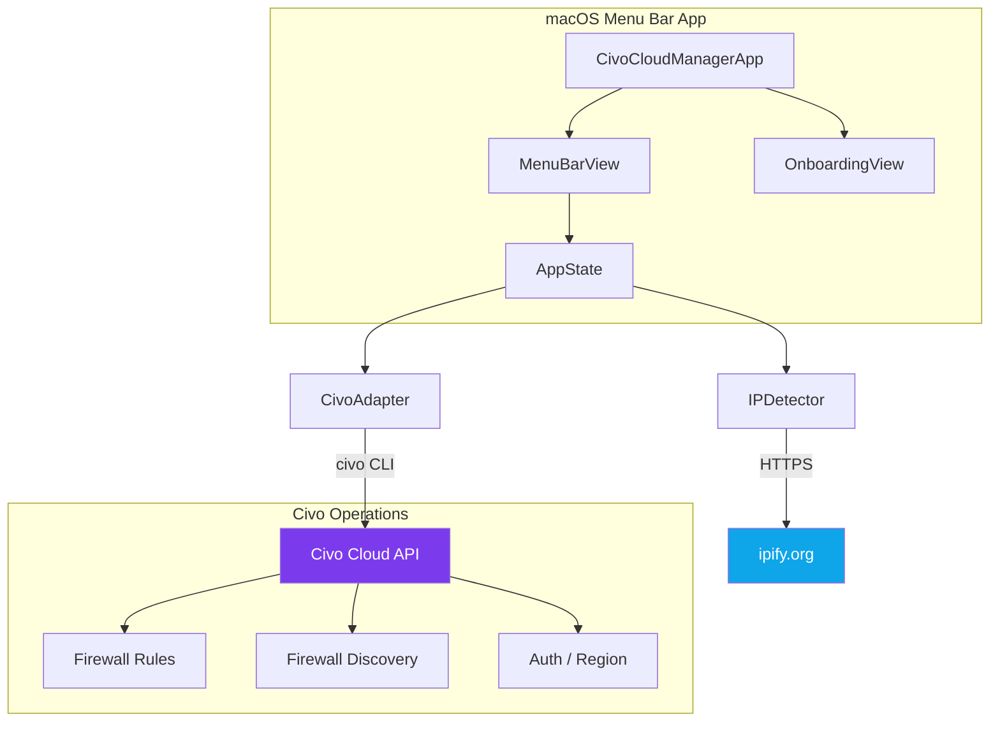
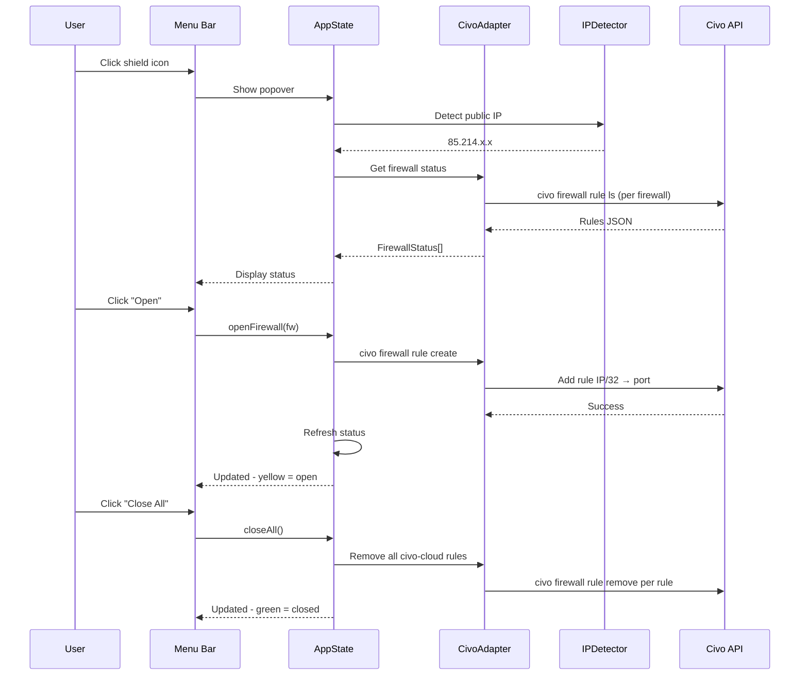
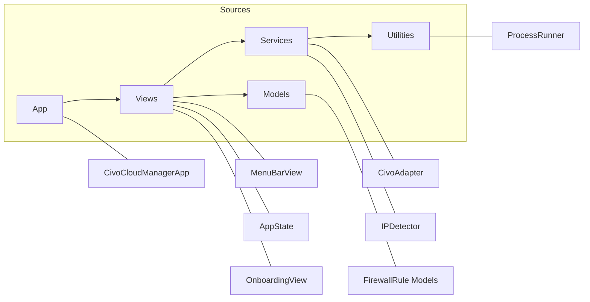

# Civo Cloud Manager

macOS menu bar app for **Civo Cloud** — manage firewall access rules for your current IP with one click. Auto-discovers firewalls from your account, configurable ports, onboarding wizard, launch at login.

## Features

- **Auto-discover firewalls** from your Civo account (no hardcoded config)
- **One-click access** — open/close firewall rules for your current public IP
- **Open All / Close All** — bulk manage all configured firewalls
- **Per-firewall port config** — set which port to open for each firewall
- **Auto-detect IP** — detects your public IPv4 via ipify.org
- **Auto-refresh** — checks status every 60 seconds
- **Onboarding wizard** — guides through CLI install, authentication, firewall selection
- **Launch at Login** — starts automatically via SMAppService
- **Menu bar only** — no Dock icon, minimal footprint
- **Rule ownership** — only manages rules created by this app (`civo-cloud-*` prefix)

## Requirements

- **macOS 15+** (Sequoia / Tahoe)
- **Civo CLI** installed and authenticated

```bash
brew install civo
civo apikey save YOUR_API_KEY --name default
civo region use fra1  # or your preferred region
```

## Installation

### Build from source

```bash
git clone https://github.com/marcelrgberger/civo-cloud-manager.git
cd civo-cloud-manager
swift build
.build/debug/CivoCloudManager
```

### Open in Xcode

```bash
open Package.swift
# Then Cmd+R to build and run
```

## Usage

1. **First launch** — the onboarding wizard checks prerequisites and discovers your firewalls
2. **Select firewalls** — choose which firewalls to manage and set the port for each
3. **Click the shield icon** in the menu bar to open the popover
4. **Open/Close** individual firewalls or use bulk actions
5. Status updates automatically every 60 seconds

### Menu Bar Icons

| Icon | Meaning |
|------|---------|
| 🟢 Shield | All firewalls closed |
| 🟡 Shield | Some firewalls open for your IP |
| 🔴 Shield | Error (CLI missing, auth failed) |

## Architecture



### Data Flow



### Components



## How It Works

1. **IPDetector** resolves your public IPv4 via `api.ipify.org` (with fallbacks)
2. **CivoAdapter** wraps the `civo` CLI — discovers firewalls, lists rules, creates/removes rules
3. **AppState** coordinates IP detection + firewall status into a unified view model
4. **MenuBarView** renders the popover with per-firewall Open/Close buttons
5. **OnboardingView** guides first-time setup (CLI install, auth, firewall selection)

### Rule Ownership

The app only manages rules it created. Rules are labeled with:

```
civo-cloud-<hostname>-<firewall-name>
```

Example: `civo-cloud-Marcels-MacBook-Pro-fw-cluster`

This ensures the app never touches rules created by other users or tools.

## Configuration

Settings are persisted in UserDefaults:

| Key | Description |
|-----|-------------|
| `CivoCloudManager.managedFirewalls` | JSON array of selected firewalls with ports |
| `CivoCloudManager.launchAtLogin` | Boolean, default true |
| `CivoCloudManager.onboardingComplete` | Boolean |

## Project Structure

```
civo-cloud-manager/
├── Package.swift
├── Sources/
│   ├── Info.plist
│   ├── App/
│   │   └── CivoCloudManagerApp.swift
│   ├── Views/
│   │   ├── MenuBarView.swift
│   │   ├── AppState.swift
│   │   └── OnboardingView.swift
│   ├── Services/
│   │   ├── CivoAdapter.swift
│   │   └── IPDetector.swift
│   ├── Models/
│   │   └── FirewallRule.swift
│   └── Utilities/
│       ├── ProcessRunner.swift
│       └── Logger.swift
├── README.md
├── LICENSE
└── .gitignore
```

## License

MIT
