# Civo Cloud Manager

[](https://apps.apple.com/de/app/civocloudmanager/id6760776010)

A native macOS app for managing Civo Cloud infrastructure from the menu bar and a full dashboard. Published by **DigitalFreedom Global LLC**, trading as DigitalFreedom.

The shipped app requires **macOS 15 or later**, matching the native Xcode target, and a Civo account with an API key. The app connects directly to Civo, Kubernetes and S3-compatible endpoints. SwiftUI, Foundation, Security, CryptoKit, StoreKit and other Apple frameworks provide the implementation; no third-party runtime dependencies or cloud CLI are required.

## Features

| Area | Capabilities |
| --- | --- |
| Menu bar | Open/close access for the current public IP, per-firewall ports, bulk actions, named IP presets, timed access, refresh every 60 seconds |
| Dashboard | Quotas, quota increase requests, resource navigation, quick search (⌘K), JSON export with secret redaction |
| Compute | Create/delete instances, start/stop/reboot, resize, reverse DNS, tags, SSH key management and local activity history |
| Kubernetes | Cluster creation, node pools, kubeconfig export, direct API access, metrics/history, events, workloads, namespaces, services, ingresses, volumes, pod logs and command execution |
| Networking | Networks, firewall rules, load balancers, domains and DNS records |
| Storage | Volumes, databases, object stores, credential management, S3 file browsing, object store pause/resume |
| Account | Billing estimates, editable rates, region selection, API health checks, legal documents |

Deletion dialogs require the resource name. Sensitive database and object store credentials use LocalAuthentication. Menu bar ownership matching and bulk closure target rules the app created, labeled `civo-cloud-<hostname>-<firewall-name>`; Kubernetes API rules use the `k8s-api` suffix.

## Build and first launch

The native Xcode project is authoritative for the app bundle, resources and target membership.

```bash
git clone https://github.com/marcelrgberger/civo-cloud-manager.git
cd civo-cloud-manager
open CivoCloudManager.xcodeproj
# Select the CivoCloudManager scheme and run.
```

For a Release build without signing:

```bash
xcodebuild -project CivoCloudManager.xcodeproj \
  -scheme CivoCloudManager -configuration Release \
  -derivedDataPath /tmp/civo-readme-build CODE_SIGNING_ALLOWED=NO build
```

`Package.swift` supports Swift build/test checks but does not validate Xcode resource or source membership. Both the native Xcode project and the Swift package declare macOS 15 as their minimum. `project.yml` and `scripts/post_xcodegen.sh` are legacy artifacts: do not regenerate the Xcode project from them.

On first launch, use the menu bar shield to complete onboarding: enter the API key, choose a region, select managed firewalls and their ports, and optionally enable Launch at Login. The main window exposes the full resource dashboard; Help and Legal are separate windows.

The app uses standard SwiftUI/AppKit components so presentation follows the running macOS version. Newer system styling does not require raising the minimum OS; any future use of newer APIs must have availability checks and a macOS 15 fallback. A successful deployment-target build verifies API availability, but does not replace a runtime smoke test on macOS 15.

## Access and the seven-day trial

All functionality is available free for **seven elapsed days from the first initialization of StoreManager**. This is a continuous period, including time while the app is closed, rather than seven separate days of active use. The start date is stored locally in UserDefaults as `fullAccessTrialStartedAt`.

After expiry, menu bar firewall management remains free. Dashboard access requires the non-consumable Full Access purchase. The paywall waits for purchase-status loading to finish; verified owners retain access. Prices are supplied by StoreKit for the user's storefront. Purchase restoration is available. Debug builds use the same access decision.

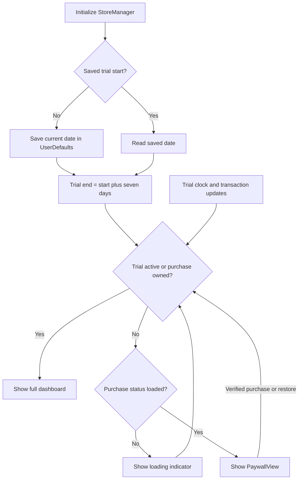
```mermaid
flowchart TD
    A[Initialize StoreManager] --> B{Saved trial start?}
    B -->|No| C[Save current date in UserDefaults]
    B -->|Yes| D[Read saved date]
    C --> E[Trial end = start plus seven days]
    D --> E
    E --> F{Trial active or purchase owned?}
    F -->|Yes| G[Show full dashboard]
    F -->|No| H{Purchase status loaded?}
    H -->|No| I[Show loading indicator]
    I --> F
    H -->|Yes| J[Show PaywallView]
    J -->|Verified purchase or restore| F
    K[Trial clock and transaction updates] --> F
```

## Architecture

Views use observable state and view models on the main actor. Resource services call `CivoAPIClient`; Kubernetes and S3 have separate clients with different authentication. The diagram groups resource-specific types for readability; it does not imply that all dependencies are injected.

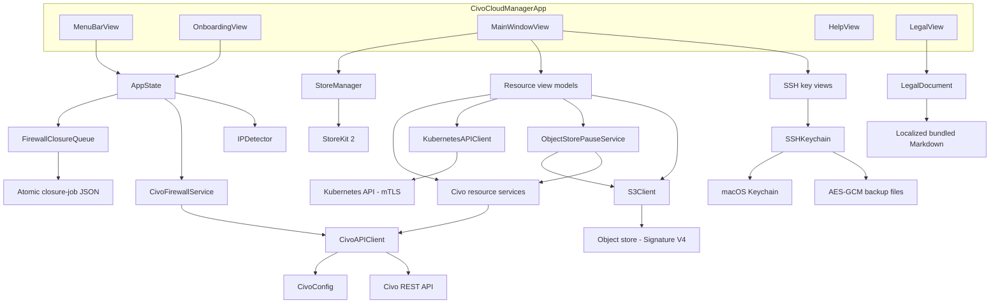
```mermaid
flowchart TB
    subgraph App[CivoCloudManagerApp]
        Menu[MenuBarView]
        Setup[OnboardingView]
        Main[MainWindowView]
        Help[HelpView]
        Legal[LegalView]
    end
    Menu --> State[AppState]
    Setup --> State
    State --> Queue[FirewallClosureQueue]
    Queue --> Disk[Atomic closure-job JSON]
    State --> Firewall[CivoFirewallService]
    State --> IP[IPDetector]
    Main --> Store[StoreManager]
    Store --> StoreKit[StoreKit 2]
    Main --> VMs[Resource view models]
    VMs --> Services[Civo resource services]
    VMs --> Kube[KubernetesAPIClient]
    VMs --> Pause[ObjectStorePauseService]
    VMs --> S3[S3Client]
    Pause --> S3
    Pause --> Services
    Firewall --> API[CivoAPIClient]
    Services --> API
    API --> Config[CivoConfig]
    API --> Cloud[Civo REST API]
    Kube --> Cluster[Kubernetes API - mTLS]
    S3 --> Objects[Object store - Signature V4]
    Main --> SSHViews[SSH key views]
    SSHViews --> SSH[SSHKeychain]
    SSH --> Keychain[macOS Keychain]
    SSH --> Backups[AES-GCM backup files]
    Legal --> Documents[LegalDocument]
    Documents --> Markdown[Localized bundled Markdown]
```

### Classes: timed firewall access

The queue and its jobs currently live in `Views/AppState.swift`. `AppState` supplies the asynchronous deletion closure to the queue; the queue itself does not own an API client.

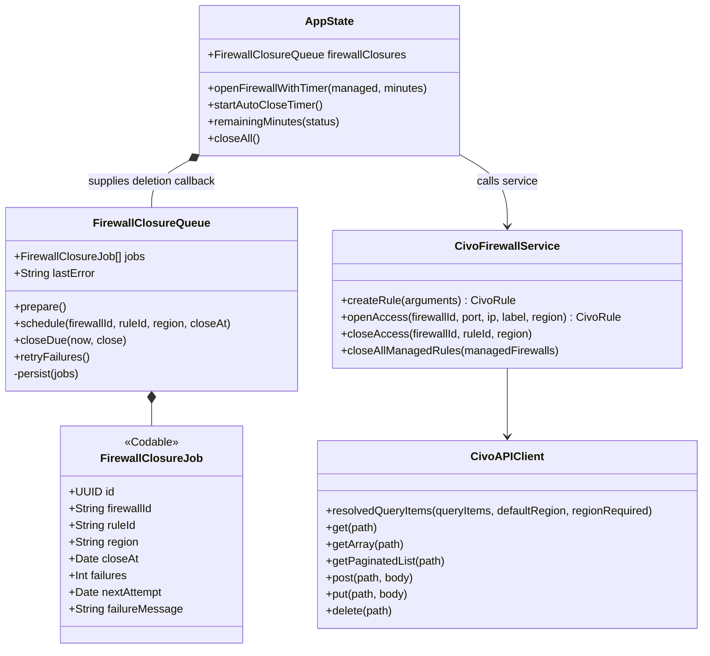
```mermaid
classDiagram
    class AppState {
        +FirewallClosureQueue firewallClosures
        +openFirewallWithTimer(managed, minutes)
        +startAutoCloseTimer()
        +remainingMinutes(status)
        +closeAll()
    }
    class FirewallClosureQueue {
        +FirewallClosureJob[] jobs
        +String lastError
        +prepare()
        +schedule(firewallId, ruleId, region, closeAt)
        +closeDue(now, close)
        +retryFailures()
        -persist(jobs)
    }
    class FirewallClosureJob {
        <<Codable>>
        +UUID id
        +String firewallId
        +String ruleId
        +String region
        +Date closeAt
        +Int failures
        +Date nextAttempt
        +String failureMessage
    }
    class CivoFirewallService {
        +createRule(arguments) CivoRule
        +openAccess(firewallId, port, ip, label, region) CivoRule
        +closeAccess(firewallId, ruleId, region)
        +closeAllManagedRules(managedFirewalls)
    }
    class CivoAPIClient {
        +resolvedQueryItems(queryItems, defaultRegion, regionRequired)
        +get(path)
        +getArray(path)
        +getPaginatedList(path)
        +post(path, body)
        +put(path, body)
        +delete(path)
    }
    AppState *-- FirewallClosureQueue : supplies deletion callback
    FirewallClosureQueue *-- FirewallClosureJob
    AppState --> CivoFirewallService : calls service
    CivoFirewallService --> CivoAPIClient
```

`lastError`, `failures`, `nextAttempt` and `failureMessage` are optional in Swift; the simplified class notation omits optional markers. Throughout the class diagrams, signatures are abbreviated: static dispatch, throwing/async annotations and Swift access levels are not represented exhaustively.

### Flow: persistent firewall deadlines

Timed access supports 15 minutes, 30 minutes, one hour and two hours; unlimited access has no closure job. The create response supplies the exact rule ID, avoiding a second label-based lookup.

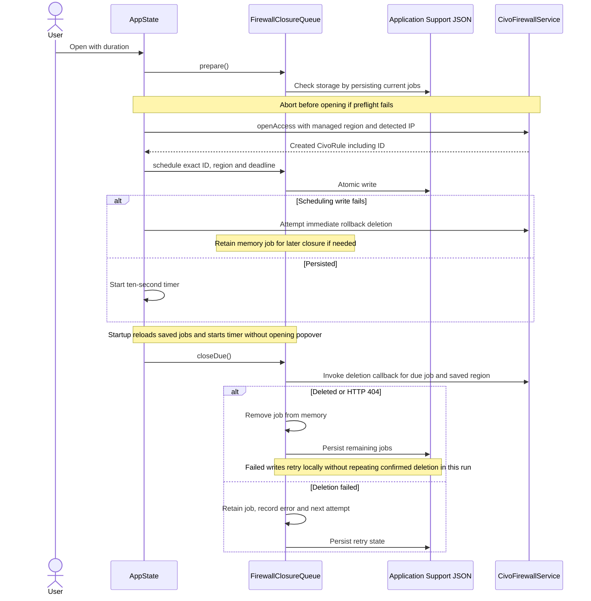
```mermaid
sequenceDiagram
    actor User
    participant State as AppState
    participant Queue as FirewallClosureQueue
    participant File as Application Support JSON
    participant API as CivoFirewallService
    User->>State: Open with duration
    State->>Queue: prepare()
    Queue->>File: Check storage by persisting current jobs
    Note over State,API: Abort before opening if preflight fails
    State->>API: openAccess with managed region and detected IP
    API-->>State: Created CivoRule including ID
    State->>Queue: schedule exact ID, region and deadline
    Queue->>File: Atomic write
    alt Scheduling write fails
        State->>API: Attempt immediate rollback deletion
        Note over Queue: Retain memory job for later closure if needed
    else Persisted
        State->>State: Start ten-second timer
    end
    Note over State,Queue: Startup reloads saved jobs and starts timer without opening popover
    State->>Queue: closeDue()
    Queue->>API: Invoke deletion callback for due job and saved region
    alt Deleted or HTTP 404
        Queue->>Queue: Remove job from memory
        Queue->>File: Persist remaining jobs
        Note over Queue,File: Failed writes retry locally without repeating confirmed deletion in this run
    else Deletion failed
        Queue->>Queue: Retain job, record error and next attempt
        Queue->>File: Persist retry state
    end
```

Retries wait 30, 60, 120 seconds and so on, capped at one hour. After eight failures, the job remains saved and requires **Retry** in the menu bar status area. Retry resets the failure state. Corrupt storage is not overwritten; the error includes its path, and Retry can reload a repaired file. Bulk Close All continues after individual failures and reports rule-deletion and rule-listing failures separately.

The app must be running and able to reach Civo to close a rule. Overdue jobs resume after launch; quitting or sleeping does not schedule server-side deletion. The persistent queue covers menu bar timed access, not the separate Kubernetes connection lifecycle.

### Flow: explicit request regions

All three region-aware Civo request paths (decoded, raw text and discarded response) use the same query resolver. A supplied region takes precedence over the selected default. This is request-level routing; it does not freeze every multi-request workflow's configuration.

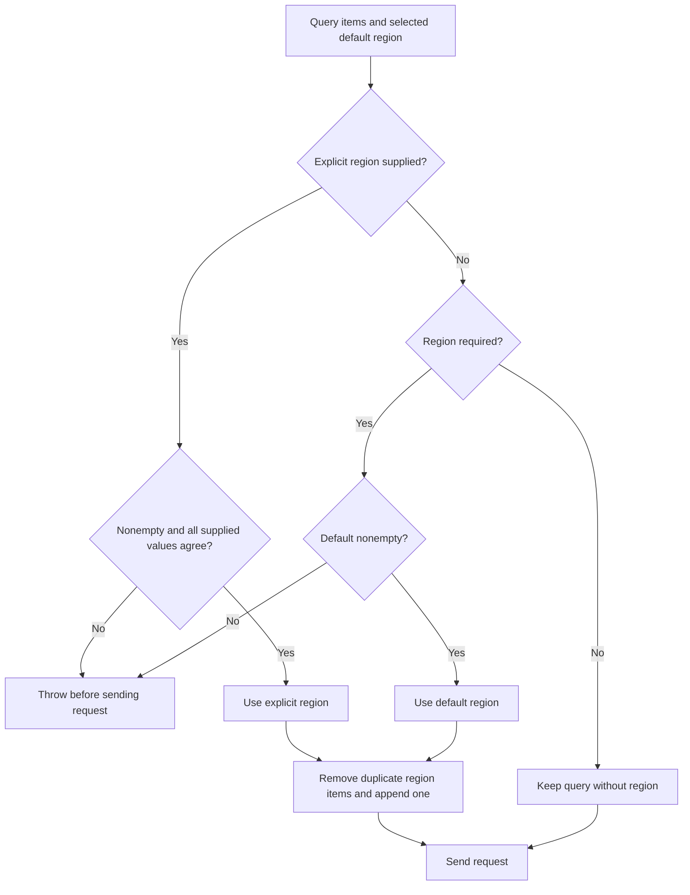
```mermaid
flowchart TD
    A[Query items and selected default region] --> B{Explicit region supplied?}
    B -->|Yes| C{Nonempty and all supplied values agree?}
    C -->|No| X[Throw before sending request]
    C -->|Yes| D[Use explicit region]
    B -->|No| E{Region required?}
    E -->|No| F[Keep query without region]
    E -->|Yes| G{Default nonempty?}
    G -->|No| X
    G -->|Yes| H[Use default region]
    D --> I[Remove duplicate region items and append one]
    H --> I
    I --> J[Send request]
    F --> J
```

### Classes: Kubernetes trust and SSH backup storage

These are independent authentication/storage paths. Kubernetes imports PEM certificates and keys through Security.framework and creates a client identity; it does not shell out to OpenSSL. SSH key generation uses CryptoKit Ed25519 in `CreateSSHKeyView`, which formats the OpenSSH export. `SSHKeychain` stores encrypted backups rather than generating SSH key pairs.

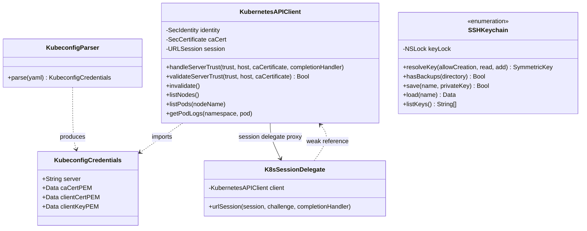
```mermaid
classDiagram
    class KubeconfigParser {
        +parse(yaml) KubeconfigCredentials
    }
    class KubeconfigCredentials {
        +String server
        +Data caCertPEM
        +Data clientCertPEM
        +Data clientKeyPEM
    }
    class KubernetesAPIClient {
        -SecIdentity identity
        -SecCertificate caCert
        -URLSession session
        +handleServerTrust(trust, host, caCertificate, completionHandler)
        +validateServerTrust(trust, host, caCertificate) Bool
        +invalidate()
        +listNodes()
        +listPods(nodeName)
        +getPodLogs(namespace, pod)
    }
    class K8sSessionDelegate {
        -KubernetesAPIClient client
        +urlSession(session, challenge, completionHandler)
    }
    class SSHKeychain {
        <<enumeration>>
        -NSLock keyLock
        +resolveKey(allowCreation, read, add) SymmetricKey
        +hasBackups(directory) Bool
        +save(name, privateKey) Bool
        +load(name) Data
        +listKeys() String[]
    }
    KubeconfigParser ..> KubeconfigCredentials : produces
    KubernetesAPIClient ..> KubeconfigCredentials : imports
    KubernetesAPIClient --> K8sSessionDelegate : session delegate proxy
    K8sSessionDelegate ..> KubernetesAPIClient : weak reference
```

### Flow: Kubernetes TLS validation

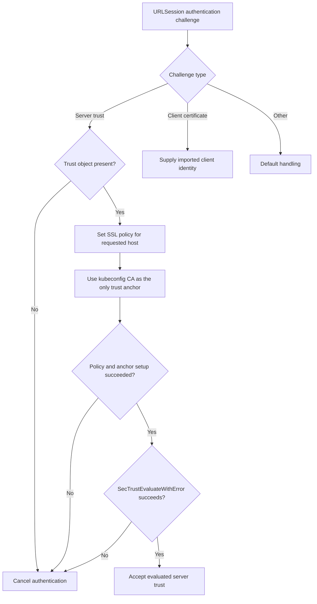
```mermaid
flowchart TD
    A[URLSession authentication challenge] --> B{Challenge type}
    B -->|Server trust| C{Trust object present?}
    C -->|No| X[Cancel authentication]
    C -->|Yes| D[Set SSL policy for requested host]
    D --> E[Use kubeconfig CA as the only trust anchor]
    E --> F{Policy and anchor setup succeeded?}
    F -->|No| X
    F -->|Yes| G{SecTrustEvaluateWithError succeeds?}
    G -->|No| X
    G -->|Yes| H[Accept evaluated server trust]
    B -->|Client certificate| I[Supply imported client identity]
    B -->|Other| J[Default handling]
```

The trust evaluation checks the server certificate chain, host and validity period. Missing trust, a wrong host, an unrelated CA or an expired leaf certificate cannot take the accept path. A weak delegate proxy avoids a session/client retain cycle; invalidation cancels outstanding requests.

The command-execution feature creates a temporary Kubernetes Job and reads its logs; it is not an interactive exec session in an existing pod.

Kubernetes auto-connect separately checks API firewall access, creates a rule if needed and attempts cleanup on disconnect. It still uses its own in-memory rule tracking; it does not inherit the timed queue's persistence and retry guarantees.

### Flow: preserving SSH encryption keys

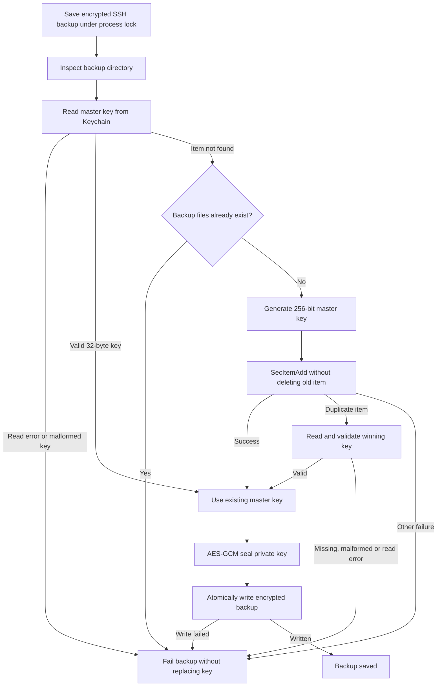
```mermaid
flowchart TD
    A[Save encrypted SSH backup under process lock] --> B[Inspect backup directory]
    B --> C[Read master key from Keychain]
    C -->|Read error or malformed key| X[Fail backup without replacing key]
    C -->|Valid 32-byte key| K[Use existing master key]
    C -->|Item not found| D{Backup files already exist?}
    D -->|Yes| X
    D -->|No| E[Generate 256-bit master key]
    E --> F[SecItemAdd without deleting old item]
    F -->|Success| K
    F -->|Duplicate item| G[Read and validate winning key]
    G -->|Valid| K
    G -->|Missing, malformed or read error| X
    F -->|Other failure| X
    K --> H[AES-GCM seal private key]
    H --> I[Atomically write encrypted backup]
    I -->|Write failed| X
    I -->|Written| J[Backup saved]
```

Only recognized Finder `.DS_Store` metadata is ignored when checking for existing backups; hidden or unknown files still block replacement. Loading a backup never creates a master key. Save/load operations use an in-process lock, and a concurrent Keychain creator is handled by reading the winning entry.

The user chooses the plaintext export location in a save dialog. If export succeeds but the encrypted backup fails, the app displays a warning in the selected app language to retain the exported file. Existing encrypted backup format and Keychain identifiers are preserved.

### Classes: access and localized legal documents

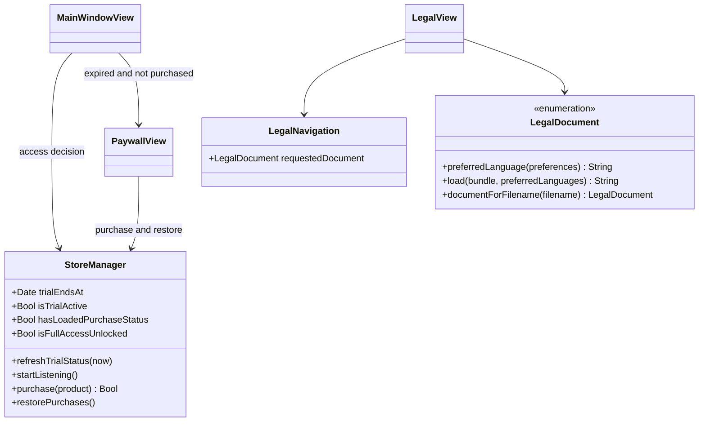
```mermaid
classDiagram
    class StoreManager {
        +Date trialEndsAt
        +Bool isTrialActive
        +Bool hasLoadedPurchaseStatus
        +Bool isFullAccessUnlocked
        +refreshTrialStatus(now)
        +startListening()
        +purchase(product) Bool
        +restorePurchases()
    }
    class MainWindowView
    class PaywallView
    class LegalNavigation {
        +LegalDocument requestedDocument
    }
    class LegalView
    class LegalDocument {
        <<enumeration>>
        +preferredLanguage(preferences) String
        +load(bundle, preferredLanguages) String
        +documentForFilename(filename) LegalDocument
    }
    MainWindowView --> StoreManager : access decision
    MainWindowView --> PaywallView : expired and not purchased
    PaywallView --> StoreManager : purchase and restore
    LegalView --> LegalNavigation
    LegalView --> LegalDocument
```

## Languages and legal identity

The app supports **16 languages: English, German, Spanish, French, Italian, Dutch, Polish, Portuguese, Simplified Chinese, Japanese, Korean, Arabic, Hindi, Indonesian, Turkish and Russian**. Seven legal documents ship in each language: Privacy Policy, Terms of Service, EULA, Acceptable Use Policy, Push Notification Consent, Trademark Disclaimer and Imprint (112 bundled Markdown files).

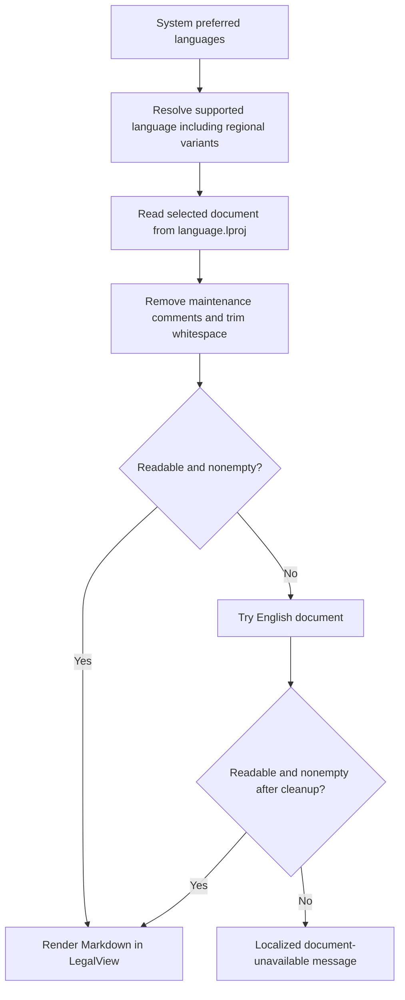
```mermaid
flowchart TD
    A[System preferred languages] --> B[Resolve supported language including regional variants]
    B --> C[Read selected document from language.lproj]
    C --> D[Remove maintenance comments and trim whitespace]
    D --> E{Readable and nonempty?}
    E -->|Yes| F[Render Markdown in LegalView]
    E -->|No| G[Try English document]
    G --> H{Readable and nonempty after cleanup?}
    H -->|Yes| F
    H -->|No| I[Localized document-unavailable message]
```

Unsupported language preferences resolve to **English**. Missing, unreadable or empty translated documents also fall back to English. Internal document links select the corresponding legal tab.

The provider is **DigitalFreedom Global LLC**, 30 N Gould St, Ste N, Sheridan, WY 82801, United States. Source provenance and localization maintenance are documented in [docs/legal-documents.md](docs/legal-documents.md). Existing bundle, purchase and Keychain identifiers are retained for App Store and credential continuity; they do not identify the current legal provider.

## Object store pause/resume

Pause copies objects into the central `civo-cloud-manager` vault, resizing it when needed. Resume recreates the store, restores objects and cleans up the vault. Transfers run with up to four concurrent whole-object `Data` buffers.

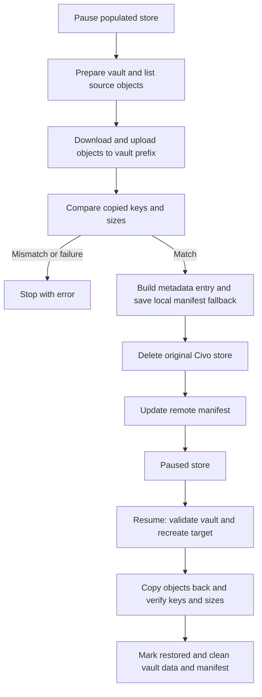
```mermaid
flowchart TD
    A[Pause populated store] --> B[Prepare vault and list source objects]
    B --> C[Download and upload objects to vault prefix]
    C --> D[Compare copied keys and sizes]
    D -->|Mismatch or failure| X[Stop with error]
    D -->|Match| E[Build metadata entry and save local manifest fallback]
    E --> F[Delete original Civo store]
    F --> G[Update remote manifest]
    G --> H[Paused store]
    H --> I[Resume: validate vault and recreate target]
    I --> J[Copy objects back and verify keys and sizes]
    J --> K[Mark restored and clean vault data and manifest]
```

This summarizes the populated-store path; empty stores use a shorter path. Verification is based on names and sizes, not a cryptographic content comparison. Remote manifest persistence follows source deletion; recovery uses the local manifest and vault contents. Streaming transfers, stronger integrity checks and recovery hardening remain architectural work, not guarantees of the current implementation.

## Persistence and current limits

| Data | Storage |
| --- | --- |
| Civo API key | macOS Keychain |
| SSH backup master key | macOS Keychain, existing service/account identifiers |
| Encrypted SSH backups | `CivoCloudManager/ssh-keys` under the app's Application Support directory |
| Timed firewall closures | Atomic `CivoCloudManager/firewall-closures.json` under Application Support |
| Region, managed firewalls, IP presets, onboarding, login preference | UserDefaults |
| Trial start | UserDefaults key `fullAccessTrialStartedAt` |
| Pause/resume metadata | Local UserDefaults manifest plus vault metadata |
| Legal documents | Bundled language-specific Markdown resources |

Application Support paths resolve inside the app's sandbox when sandboxed. The network-client entitlement permits API access; user exports use user-selected locations. Launch at Login uses `SMAppService`.

Remaining architecture limitations include mutable shared API configuration across multi-request workflows, services coupled to shared clients, and `getPaginatedList` currently returning one response page rather than traversing every page. A failed firewall status lookup still produces a closed/unknown model state, so that display is not proof of server-side closure. The local trial timestamp is not tamper-resistant. These limitations are distinct from the four completed TLS, query-region, timed-closure and SSH-preservation fixes.

## Validation

The current suite contains **41 tests in seven suites**: response decoding, free-trial access, localized legal documents, Kubernetes TLS trust, request-region routing, persistent firewall closures and SSH encryption key preservation. Manual firewall Retry saves the reset immediately; regression coverage includes an immediate restart and a failed reset write followed by recovery.

```bash
swift test --scratch-path /tmp/civo-tests
python3 scripts/check_legal_localizations.py
python3 scripts/check_app_localizations.py
```

The regression tests cover certificate rejection and callback decisions; duplicate/conflicting regions; saved deadlines, restart, retry limits, reentrant timer ticks and disk-write failures; and Keychain errors, duplicate creation, backup-file detection and encryption round trips. Tests use fixtures and temporary storage rather than altering cloud resources or the real SSH Keychain.

A native Xcode Release build additionally verifies target membership and resources. The four architecture fixes were each reviewed through the Claude CLI before their separate commits; all 40 tests and the Release build passed for that code revision. This is not a claim of live cloud integration coverage.

## Source map

| Location | Responsibility |
| --- | --- |
| `CivoCloudManager/App/CivoCloudManagerApp.swift` | Menu bar scene and onboarding, main, help and legal windows |
| `CivoCloudManager/Views/AppState.swift` | Menu bar state and persistent firewall closure queue/jobs |
| `CivoCloudManager/Views/MenuBarView.swift` | Menu controls, closure errors and Retry |
| `CivoCloudManager/Views/MainWindow/` | Resource screens and creation forms |
| `CivoCloudManager/Views/Shared/` | Paywall, Markdown rendering, search, export and reusable controls |
| `CivoCloudManager/ViewModels/` | Resource loading and workflows |
| `CivoCloudManager/Models/` | Civo, Kubernetes, S3 and app data models |
| `CivoCloudManager/Services/` | API clients, resource services, SSH backups, StoreKit and pause/resume |
| `CivoCloudManager/Localizable.xcstrings` | App string catalog for 16 languages |
| `CivoCloudManager/*.lproj/` | Localized app metadata and legal documents |
| `CivoCloudManagerTests/APIDecodingTests.swift` | Seven Swift Testing suites |
| `docs/legal-documents.md` | Legal source provenance and maintenance |
| `scripts/check_legal_localizations.py` | Legal document consistency and optional built-bundle checks |
| `scripts/check_app_localizations.py` | Complete catalog coverage, format arguments and optional built-bundle checks |

## License

Proprietary. Copyright (c) 2025–2026 DigitalFreedom Global LLC. All rights reserved. Distributed exclusively via the Apple App Store. See [LICENSE](LICENSE), [EULA.md](EULA.md) and [PRIVACY.md](PRIVACY.md).
